<!-- 
リンク：
    [OCI Network Firewallを構築する](/ocitutorials/security/networkfirewall-setup/) 
-->

OCI Network Firewall は2022年7月にリリースされた、OCIクラウドネイティブのマネージド・ファイアウォール・サービスです。
IDS/IPS を始め、URLフィルタリングやTLS/SSL検査など、Palo Alto Networks社の次世代ファイアウォール技術を基に構築された機能を提供します。  
本チュートリアルでは OCI Network Firewall が動作するための環境を構築し、簡単なテストにて動作を確認するまでを行います。

**所要時間 :** 
+ 約70分

**前提条件 :**
+ ユーザーに必要な IAM ポリシーが割り当てられていること。ポリシーの詳細は[ドキュメント](https://docs.oracle.com/ja-jp/iaas/Content/network-firewall/overview.htm#iam)を参照ください。

**注意 :**
+ 本チュートリアル内の画面ショットは、OCIのコンソール画面と異なる場合があります。

<br>


# 0. はじめに
## ・実施内容
以下が本チュートリアルで作成するNetwork Firewallの構成図です。
OCI環境を出入りする通信はNetwork Firewallを経由し、監視および検査が行われます。

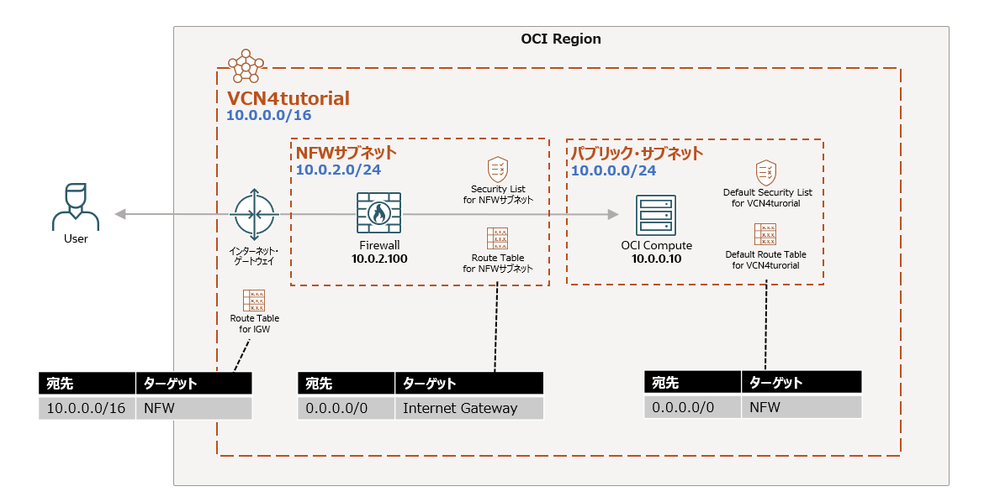

本チュートリアルでは動作テストのために OCI 内に WEB サーバーを準備した後、ウィルステストファイルを配置し、外部からの通信が Network Firewall によってブロックされることを確認するところまでを行います。

## ・Network Firewallの概要
Network Firewall は OCI のマネージド次世代ファイアウォール・サービスとして、脆弱性攻撃やマルウェア、C&Cサーバーなどの脅威を検知・防御などさまざまな機能を提供しています。

OCI の仮想ルーティングにより Network Firewallインスタンスへ通信を一次集約し、通信TLSトラフィックも含めたすべてのリクエストを検査を行います。  
この際、通信の検出やフィルタリングについては、ユーザーが構成したファイアウォール・ポリシー・ルールに基づき、許可、拒否、ドロップ、侵入検出、防止などのアクションを実行します。

より詳細な情報については以下資料をご参照ください。
- [OCI Network Firewall 概要 - Speaker Deck](https://speakerdeck.com/oracle4engineer/oci-network-firewallgai-yao)
- [OCI Network Firewallの構成（考慮事項と構成例）- Speaker Deck](https://speakerdeck.com/oracle4engineer/oci-network-firewall-configuration)

<br>

## ・ルーティングについて
インターネット経由でパブリックサブネット内のインスタンスに到達する内向き通信は、インターネットゲートウェイのルート表に基づき、NFWサブネット内の Network Firewall を通過します。その後、検査済みトラフィックがパブリックサブネット内のインスタンスに転送されます。  
一方、パブリックサブネット内のインスタンスから発生する外向きの通信も、ルート表の設定により Network Firewall を通過します。この際、検査済みの通信は、サブネットに適用されたルート表のルート・ルールを基にインターネットゲートウェイを介して外部へ送信されます。

<br>


# 1. ネットワークの構築

## 1-1. VCNの作成
OCIコンソール画面にアクセスし、左上の **[メニューボタン] → [ネットワーキング] → [仮想クラウド・ネットワーク]** と移動します。  
**[VCNウィザードの起動]** を選択します。

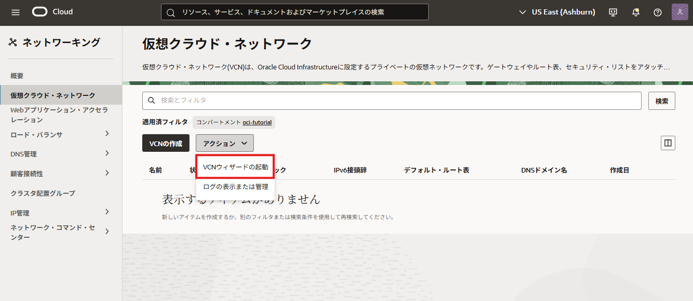

**「インターネット接続性を持つVCNの作成」** を選択。

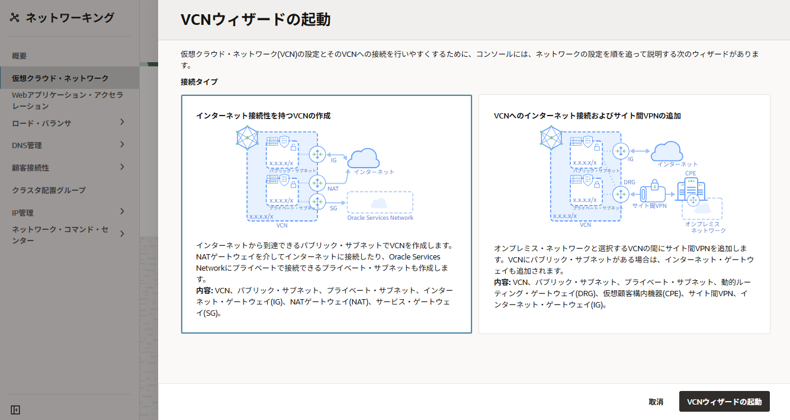

VCN作成画面にて以下項目を入力し、**[次]** をクリックします。

| 設定項目 | 設定値 | 
|---|---|
| VCN名 | (任意) VCN4tutorial |
| コンパートメント | \<VCNを作成するコンパートメントを選択\> |
| VCN IPv4 CIDRブロック | 10.0.0.0/16 | 

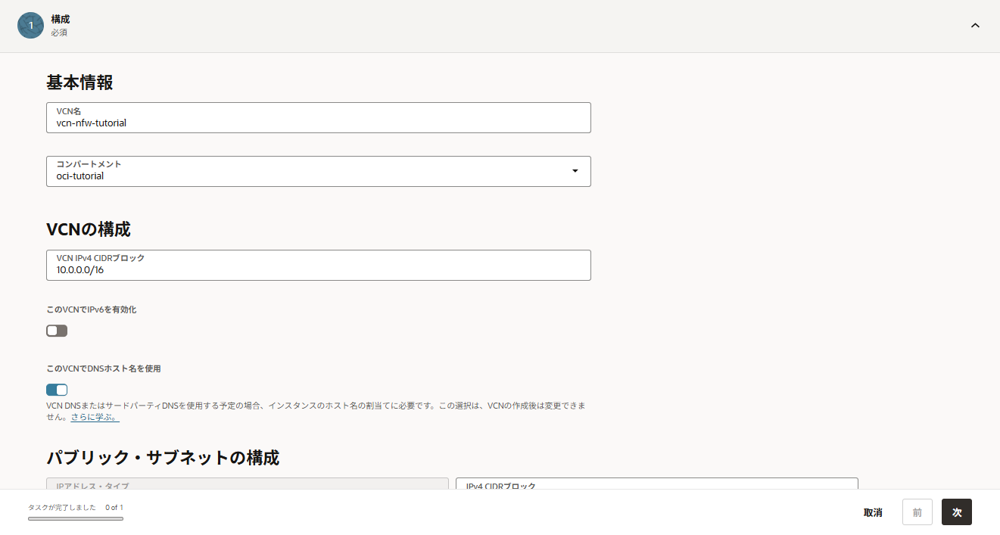

作成されるリソースを確認し、**[作成]** をクリックすると以下の環境でVCNが作成されます。  

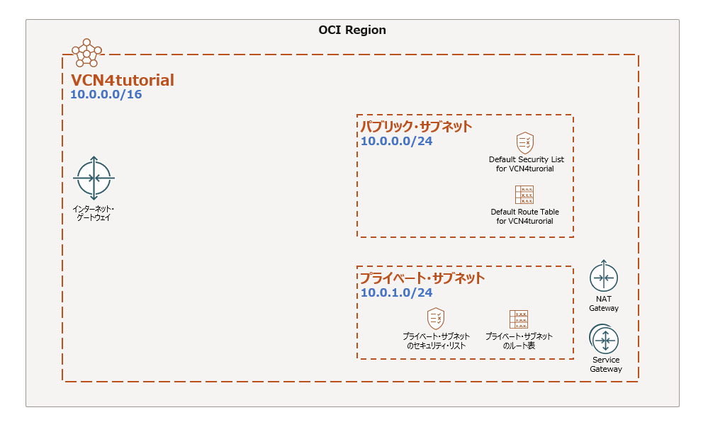

※ ウィザードではその他にプライベート・サブネット、サービス・ゲートウェイ、NATゲートウェイが作成されますが、今回の手順では使用しません。そのため、後続の構成図ではこれらのリソースを省略しています。

<br>

## 1-2. Network Firewall用サブネットの作成
Network Firewall を配置するためのサブネットを作成します。
サブネット作成前に、必要となるルート表とセキュリティ・リストを準備します。

### ・ルート表の作成
作成した VCN詳細画面の「ルーティング」タブより **[ルート表の作成]** ボタンをクリックします。  
ルート表作成画面にて以下項目を入力し、**[作成]** をクリックします。

| 設定項目 | 設定値 | 
|---|---|
| 名前 | Route Table for NFWサブネット |
| コンパートメント | \<VCNを作成するコンパートメントを選択\> |
| `[＋別のルート・ルール]` を選択 | |
| ターゲット・タイプ | インターネット・ゲートウェイ |
| 宛先CIDRブロック | 0.0.0.0/0 |
| ターゲット・インターネット・ゲートウェイ | インターネット・ゲートウェイ-\<VCN名\> |

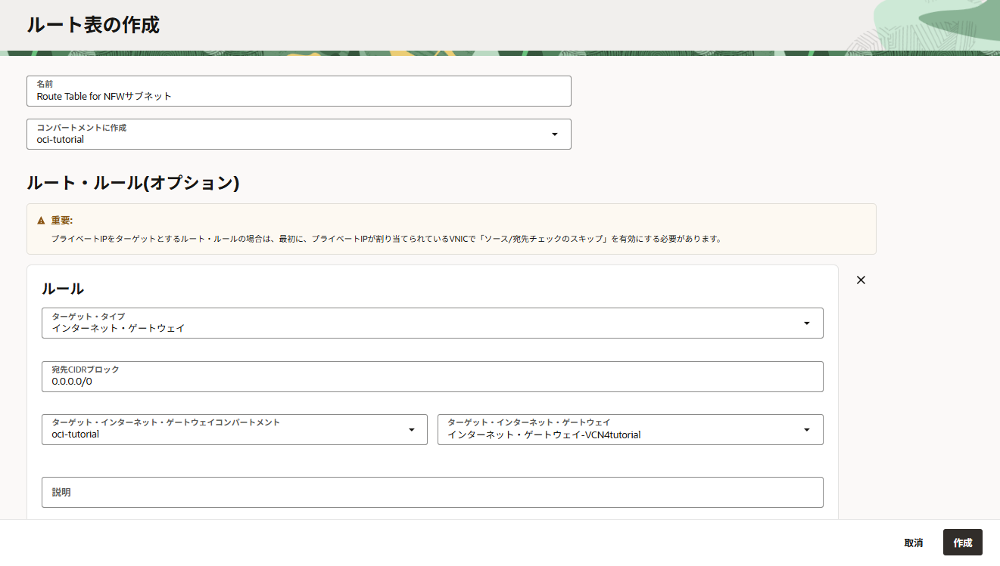


### ・セキュリティ・リストの作成

作成した VCN詳細画面の「セキュリティ」セクションより **[セキュリティ・リストの作成]** ボタンを選択します。
セキュリティ・リスト作成画面にて以下項目を入力し、**[セキュリティ・リストの作成]** をクリックします。


| 設定項目 | 設定値 | 
|---|---|
| 名前 | Security List for NFWサブネット |
| コンパートメント | \<任意のコンパートメントを選択\> |
| `[＋別のイングレス・ルール]` を選択 |  |
| ソース・タイプ | CIDR |
| ソースCIDR | 0.0.0.0/0 |
| IPプロトコル | TCP |
| 宛先ポート範囲 | 80 |
| 説明 | (任意) HTTP通信を許可 |
| `[＋別のイングレス・ルール]` を選択 |  |
| ソース・タイプ | CIDR |
| ソースCIDR | 0.0.0.0/0 |
| IPプロトコル | TCP |
| 宛先ポート範囲 | 22 |
| 説明 | (任意) SSH接続を許可 |
|||
| `[＋別のエグレス・ルール]` を選択 |  |
| 宛先タイプ | CIDR |
| 宛先CIDR | 0.0.0.0/0 |
| IPプロトコル | すべてのプロトコル |
| 説明 | (任意) 任意のアウトバウンド通信を許可 |

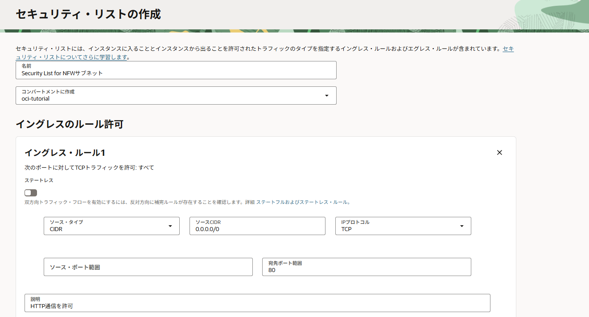
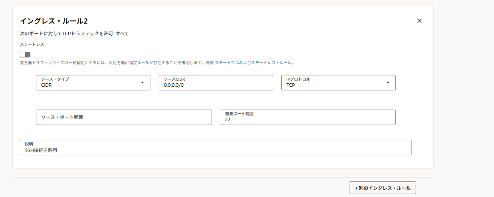
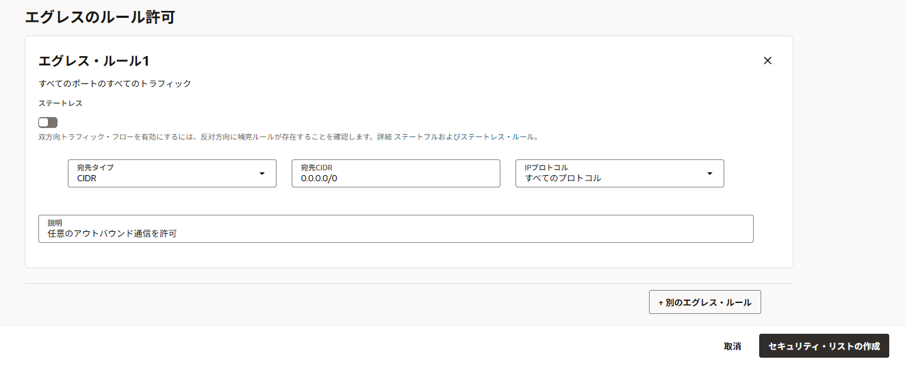

### ・サブネットの作成
作成した VCN詳細画面の「サブネット」タブより **[サブネットの作成]** ボタンを選択します。
サブネット作成画面にて以下項目を入力し、**[サブネットの作成]** をクリックします。

| 設定項目 | 設定値 | 
|---|---|
| 名前 | NFWサブネット |
| サブネット・タイプ | リージョナル |
| IPv4 CIDRブロック | 10.0.2.0/24 |
| ルート表 | Route Table for NFWサブネット |
| サブネット・アクセス | パブリック・サブネット |
| DNS解決 | (任意) |
| セキュリティ・リスト | Security List for NFWサブネット |


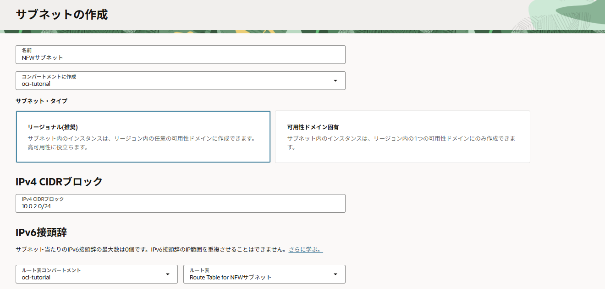
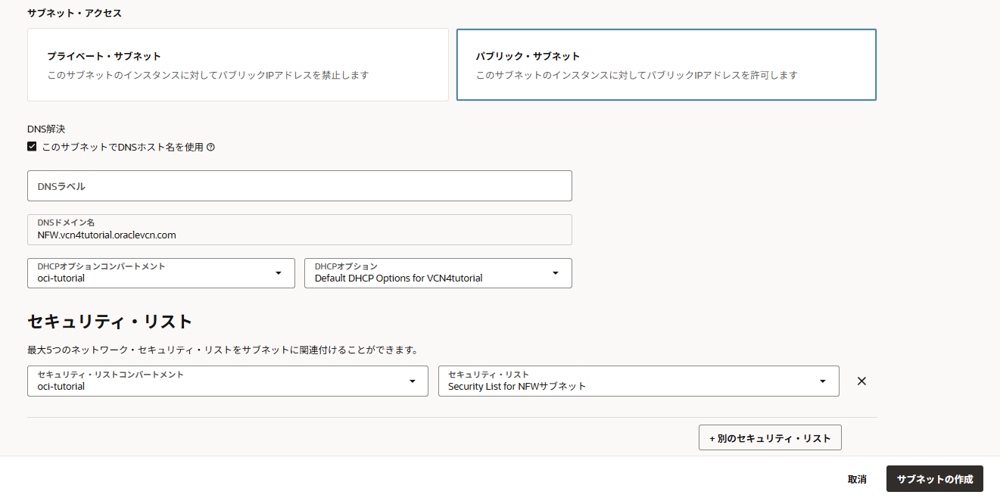

ここまでで以下の構成が整いました。

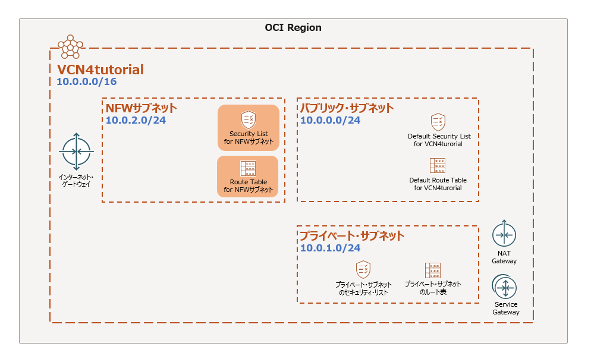

<br><br>


# 2. Network Firewallの作成

## 2-1. ネットワーク・ファイアウォール・ポリシーの作成
Network Firewallインスタンスを作成する際、ネットワーク・トラフィックを制御するルールをまとめたポリシー、**ネットワーク・ファイアウォール・ポリシー**を指定する必要があります。そのため事前に以下の手順でポリシーを作成します。

OCIコンソール画面左上のメニューボタンより、**[アイデンティティとセキュリティ] → [ファイアウォール] → [ネットワーク・ファイアウォール・ポリシー]** と移動、**[ネットワーク・ファイアウォール・ポリシーの作成]** をクリックします。  
表示された作成画面にて以下の項目を入力し、**[作成]** ボタンをクリックします。

| 設定項目 | 設定値 | 
|---|---|
| 名前 | nfw_pol_tutorial |
| コンパートメント | \<任意のコンパートメントを選択\> |

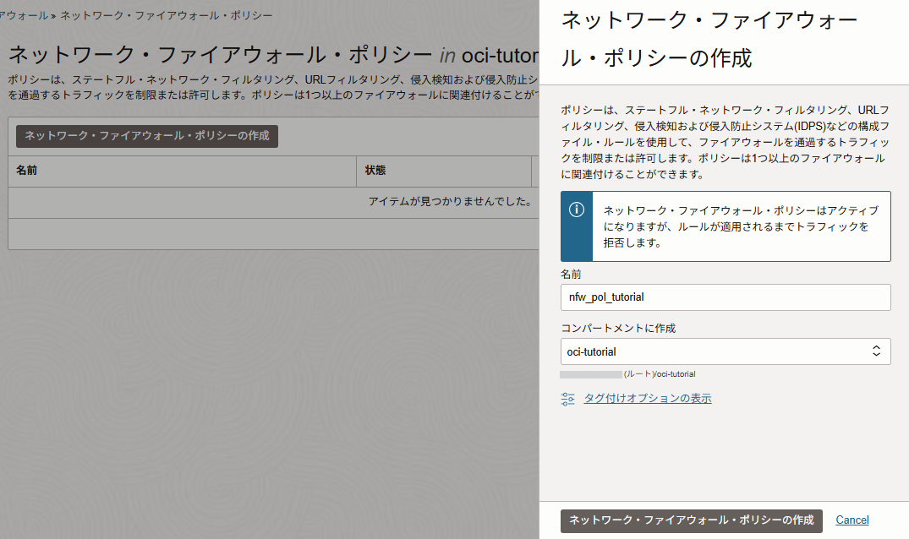


## 2-2. ネットワーク・ファイアウォール・ポリシーの設定
Network Firewall ではデフォルトですべての通信は拒否されます。そのため、以下の手順ですべての通信を許可しつつ、疑わしい通信をブロックするルールを設定します。

ポリシー詳細画面の「セキュリティ・ルール」タブで、**[セキュリティ・ルールの作成]** ボタンをクリックします。
作成画面にて以下項目を入力し、セキュリティ・ルールを作成します。

| 設定項目 | 設定値 | 
|---|---|
| 名前 | idp |
| ソース・アドレス | 任意のアドレス |
| 宛先アドレス | 任意のアドレス |
| アプリケーション | 任意のアプリケーション |
| サービス | 任意のサービス |
| URL | 任意のURL |
|  |  |
| ルール・アクション | 侵入防止 |

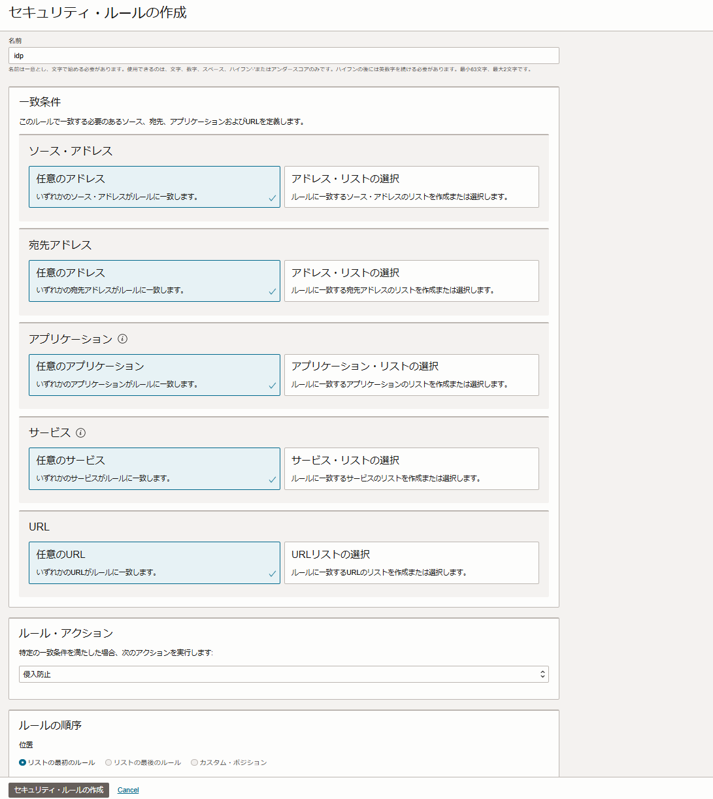


## 2-3. Network Firewallインスタンスの作成

続いてNetwork Firewallインスタンスを作成します。
OCIコンソール画面左上のメニューボタンより、**[アイデンティティとセキュリティ] → [ファイアウォール]** と移動、**[ネットワーク・ファイアウォールの作成]** をクリックします。

作成画面にて以下の項目を入力し、**[ネットワーク・ファイアウォールの作成]** をクリックします。

| 設定項目 | 設定値 | 
|---|---|
| 名前 | NFW4tutorial |
| コンパートメント | \<任意のコンパートメントを選択\> |
| ネットワーク・ファイアウォール・ポリシー | nfw_pol_tutorial（先ほど作成したネットワーク・ファイアウォール・ポリシーを選択） |
| 仮想クラウド・ネットワーク | VCN4tutorial |
| サブネット | NFWサブネット (リージョナル) |
| ネットワーク・セキュリティ・グループを使用してトラフィックを制御 | 無効化 |
| IPアドレスをサブネットからファイアウォールに手動で割り当てます | (任意) ※ |
| ファイアウォールでのNATの有効化 | 無効化 |

※ サブネット内のIPアドレスを明示的に指定する場合は指定します。本チュートリアルではIPアドレスを「10.0.2.100」に指定しています。

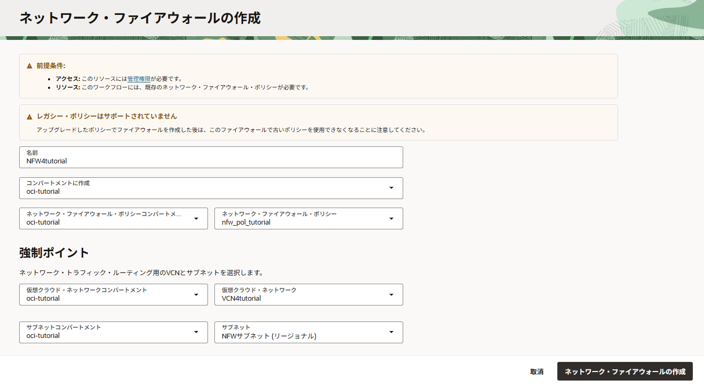

Network Firewallインスタンスの作成には 約40分 かかります。作成中に詳細画面で IPv4アドレスを確認できるので、以降のルーティング設定で使用するために控えておいてください。

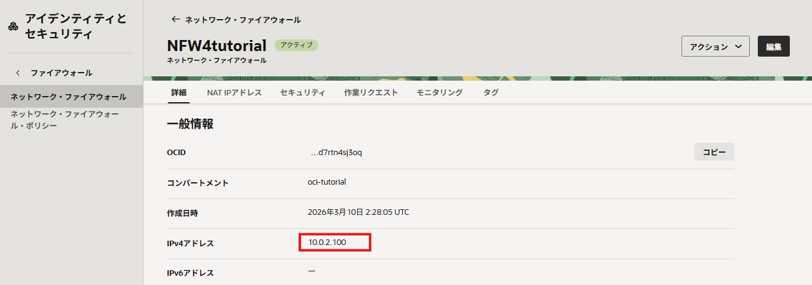

Network Firewallを作成している間、続く手順３，４を進めます。

<br><br>


# 3. テストWebページ用のコンピュートインスタンスの作成と設定

## 3-1. コンピュートインスタンスの作成
この手順では、パブリックサブネット内にWebサーバーを構築し、Webページへのアクセスを確認します。

OCIコンソール画面左上のメニューボタンより、**[コンピュート] → [インスタンス]** と移動、**[インスタンスの作成]** をクリックし、作成画面にて以下の設定を入力し作成します。

| 設定項目 | 設定値 | 
|---|---|
| **【１ 基本情報】** | |
| 名前 | websvr4tutorial |
| コンパートメント | \<任意のコンパートメントを選択\> |
| 可用性ドメイン | (任意) AD1 |
| イメージ | Oracle Linux 9 |
| Shape | (任意) VM.Standard.E5.Flex |
| `> 拡張オプション`を選択 | |
| 初期化スクリプト | 「cloud-initスクリプトの貼付け」を選択し、後述するスクリプトを貼り付けます。※3 |
| **【２ セキュリティ】** | |
| セキュリティ | (任意) ここでは設定しません。 |
| **【３ ネットワーキング】** ||
| プライマリVNIC | (任意) |
| 仮想クラウド・ネットワーク | VCN4tutorial |
| サブネット | パブリック・サブネット-VCN4tutorial (リージョナル) |
| プライベートIPv4アドレスの割当て | (任意) ※1 |
| パブリックIPv4アドレス割当て | (任意) トラブルシューティングのため直接インスタンスに接続することがあります。インターネットから直接接続されることが許されている場合、有効化をおすすめします。|
| SSHキーの追加 | 「キー・ペアを自動で生成」を選択し、秘密キーと公開キーをそれぞれ保存します。※2 |
| **【４ ストレージ】** |  |
| ブート・ボリューム | (任意) ここでは設定しません。 |
| ブロック・ボリューム | (任意) ここでは設定しません。 |

※1 サブネット内のIPアドレスを明示的に指定する場合は指定します。本チュートリアルではIPアドレスを「10.0.0.10」に指定しています。  
※2 手元に既存のSSHキーがある場合は、「公開キー・ファイルのアップロード」または「公開キーの貼りつけ」を選択し、公開キーを登録してください。  
※3 cloud-init には以下を貼り付けます。

```
#cloud-config
packages:
  - httpd

runcmd:
  - systemctl enable --now httpd
  - firewall-cmd --add-service=http --permanent
  - firewall-cmd --reload
  - curl https://secure.eicar.org/eicar.com.txt > /var/www/html/eicar.html
```


apache HTTPS serverをインストールし、起動しています。また、ウイルス対策ソフトの応答をテストするためeicarファイルをeicarのHPより取得し、`/var/www/html/eicar.html`へ新規に配置しています。そのため、インスタンスがインターネット・ゲートウェイかNATゲートウェイを使用してインターネットと通信できるようにルーティング構成されている必要があることにご注意ください。  
この動作はインスタンスの作成と同時に行われます。 


以上の項目を入力し、**[作成]** をクリックします。

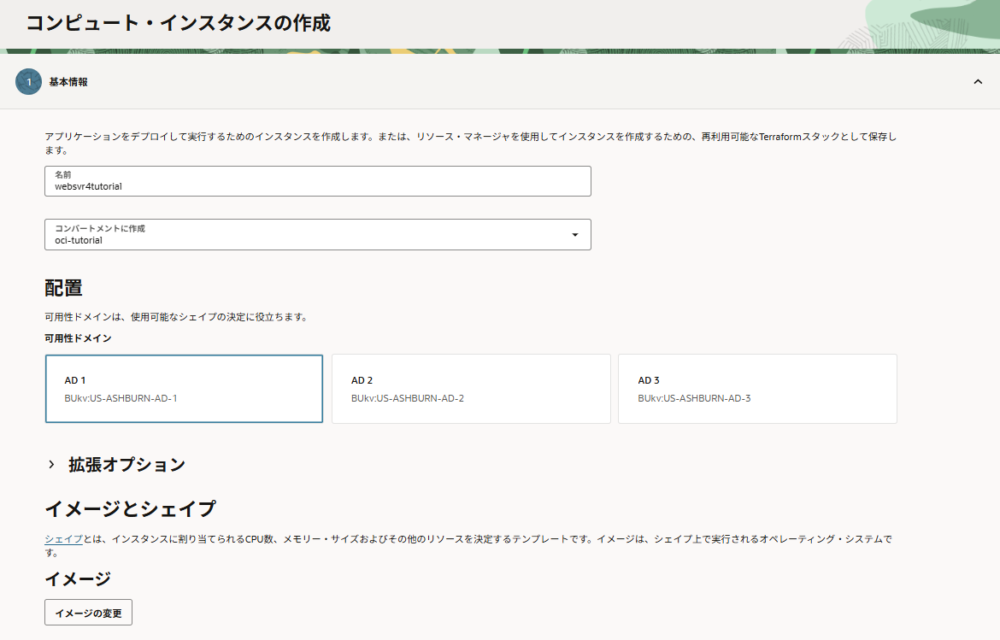
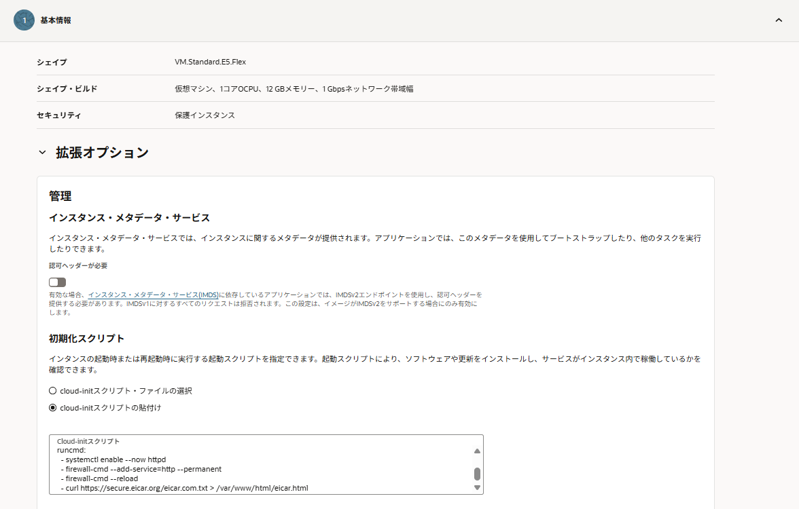
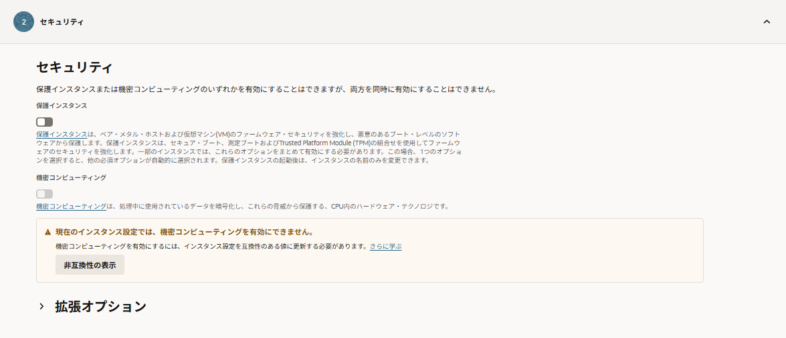
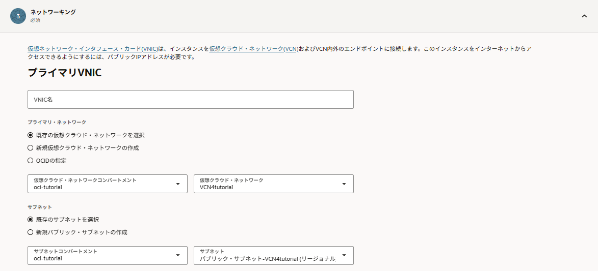
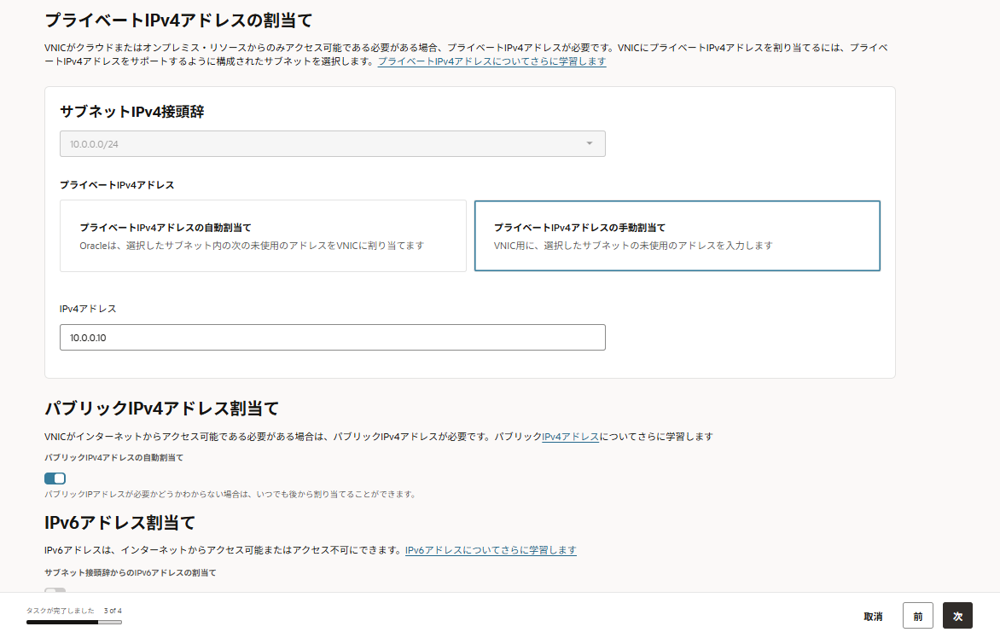
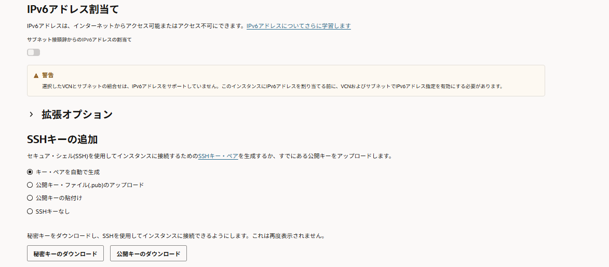
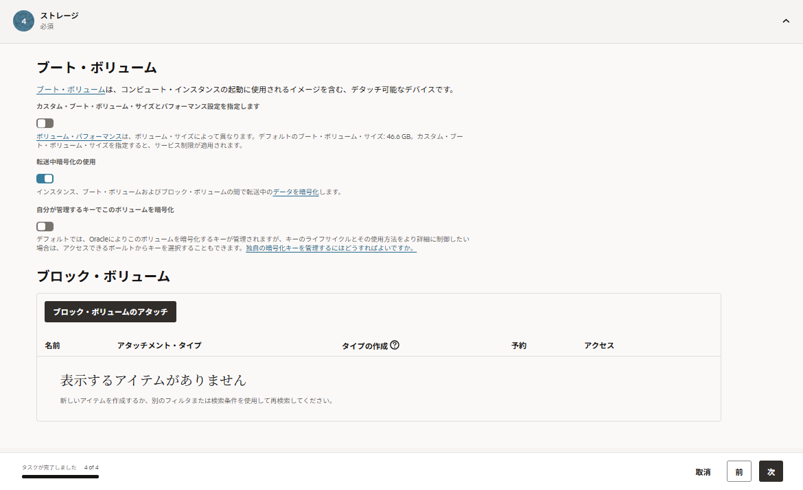

ここまでで以下の構成となりました。

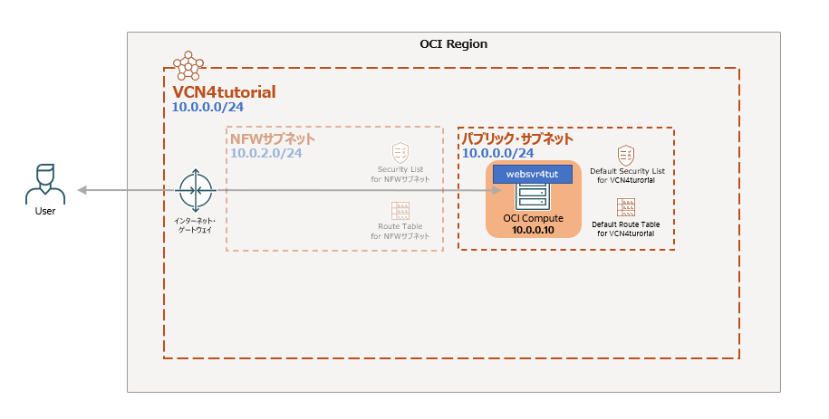

この後、コンピュート上に作成されたテスト用のWebページにアクセスしますので、割り当てられたパブリックIPアドレスを控えておきます。  
初期化スクリプトの実行には数分かかりますので、その間にWebページにアクセスできるように次の手順にて通信の許可設定を行います。


## 3-2. HTTPアクセスのためのセキュリティ・リストの編集

OCIコンソール画面にアクセスし、左上のメニューボタンより、**[ネットワーキング] → [仮想クラウド・ネットワーク] → [VCN4tutorial]** と移動します。  
VCN詳細画面の「セキュリティ」タブからセキュリティ・リストの **[Default Security List for VCN4tutorial]** を選択します。  
その後、「セキュリティ・ルール」タブを選択し、**[イングレス・ルールの追加]** ボタンより以下のイングレス・ルールを追加します。

| 設定項目 | 設定値 | 
|---|---|
| ソース・タイプ | CIDR |
| ソースCIDR | 0.0.0.0/0 |
| IPプロトコル | TCP |
| 宛先ポート範囲 | 80 |
| 説明 | (任意) HTTP通信を許可 |

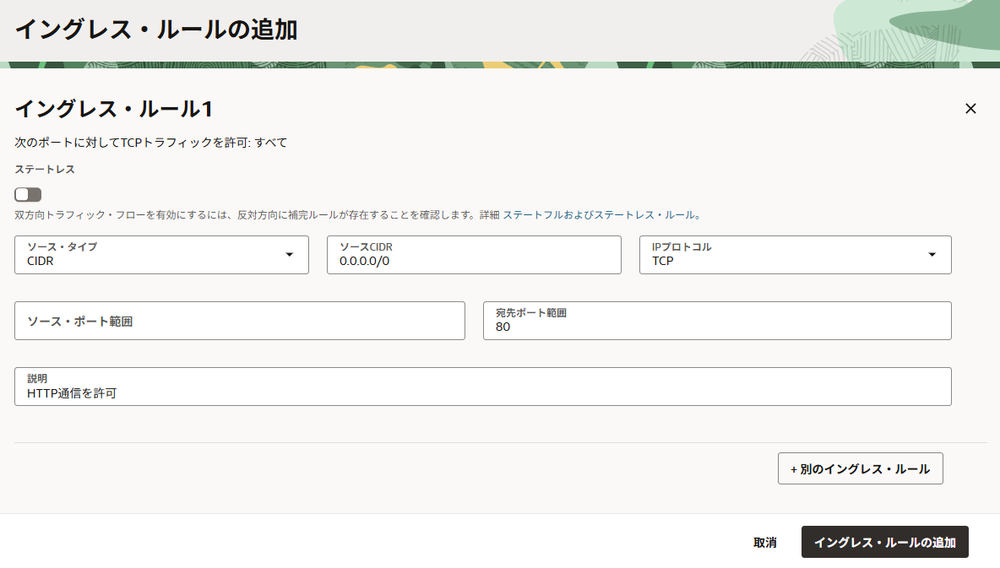


## 3-3. Webページへのアクセスを確認

ブラウザで以下のURLにアクセスし、テストページが正しく表示されることを確認します。

```
http://<コンピュートのパブリックIP>/
```

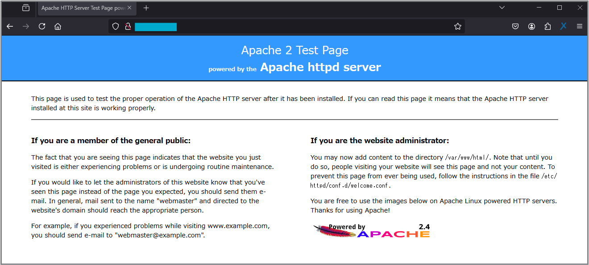

アクセスできない場合、初期化スクリプトの実行がまだ完了していない可能性があります。数分待ってから再試行してください。（参考：筆者の環境では約2分半で完了しました）  
それでもアクセスできない場合、cloud-init が正しく動作していないことが考えられます。対象インスタンスへSSH接続を行い、cloud-initで行う以下の処理を手動で実行してください。

```shell
dnf install -y httpd

systemctl enable --now httpd

firewall-cmd --add-service=http --permanent
firewall-cmd --reload

curl -o /var/www/html/eicar.html https://secure.eicar.org/eicar.com.txt
```

次に、以下のURLにアクセスし、eicarファイルが正しく表示されることを確認します。

```
http://<コンピュートのパブリックIP>/eicar.html
```

eicarファイルはウイルス対策ソフトの応答をテストするためのテキストファイルです。この時点では、Network Firewall を経由していないため、文字列が表示されることが確認できます。

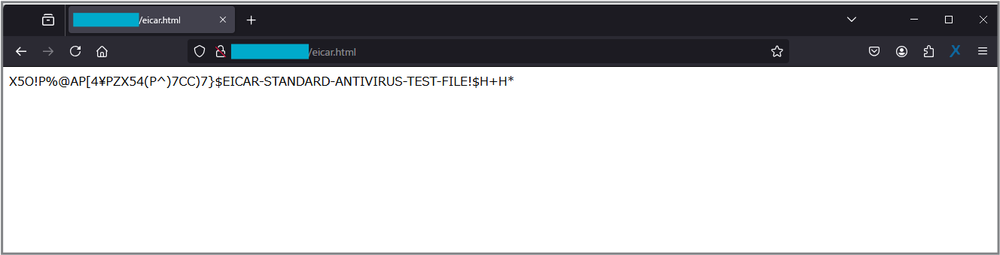

<br><br>


# 4. Firewallを経由するためのルーティング設定
Network FirewallインスタンスのプライベートIPアドレスを元に、通信が Firewallインスタンスを経由するようにルーティングの設定を行います。

## 4-1. Internet Gatewayのルート表の編集
OCIコンソール画面にアクセスし、左上の **[メニューボタン] → [ネットワーキング] → [仮想クラウド・ネットワーク] → [VCN4tutorial]** と移動します。  
作成したVCN詳細画面の「ルート表」タブより **[ルート表の作成]** ボタンをクリックします。
ルート表作成画面にて以下項目を入力し、**[作成]** をクリックします。

| 設定項目 | 設定値 | 
|---|---|
| 名前 | Route Table for IGW |
| コンパートメント | \<任意のコンパートメントを選択\> |
| `[＋別のルート・ルール]`を選択 |  |
| ターゲット・タイプ | プライベートIP |
| サブネットまたはVLANコンパートメント | \<サブネットが所属するコンパートメントを選択\> |
| 宛先CIDRタイプ | CIDRブロック |
| 宛先CIDRブロック | 10.0.0.0/16 |
| ターゲット選択 | 10.0.2.100（Network FirewallインスタンスのプライベートIPアドレス） |

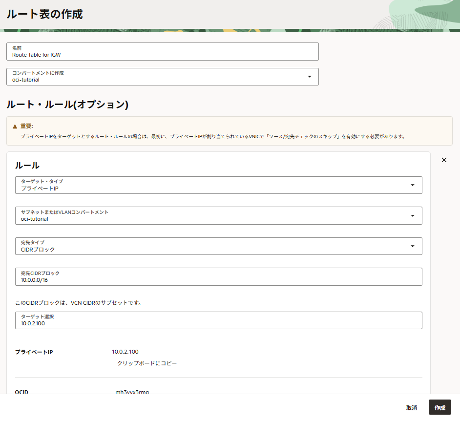

作成したルート表をインターネット・ゲートウェイに関連付けます。  
VCN詳細画面の「ゲートウェイ」タブを選択し、作成されているインターネット・ゲートウェイのケバブメニューから **[ルート表の関連付け]** をクリックします。  
ルート表 **[Route Table for IGW]** を選択し、**[ルート表の関連付け]** をクリックします。

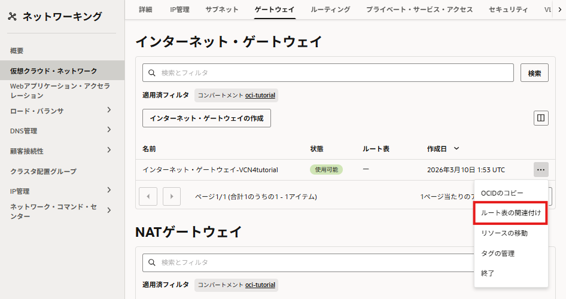


## 4-2. パブリック・サブネットのルート表の編集

パブリック・サブネット内からの通信が Network Firewallインスタンスを経由するようにルート表を編集します。  
作成した VCN詳細画面の「ルーティング」タブより **[default route table for VCN4tutorial]** を選択し、既存のルート・ルールを編集し以下の新しいルート・ルールに変更します。


| 設定項目 | 設定値 (変更差分) | 
|---|---|
| 名前 | Route Table for IGW |  
| コンパートメント | \<任意のコンパートメントを選択\> |
| ターゲット・タイプ | ~インターネット・ゲートウェイ~ → プライベートIP |
| 宛先CIDRタイプ | CIDRブロック | (変更無し) |
| 宛先CIDRブロック | 0.0.0.0/0 | (変更無し) |
| ターゲット選択 | ~インターネット・ゲートウェイ-VCN4tutorial~ → 10.0.2.100（Network FirewallインスタンスのプライベートIPアドレス） |


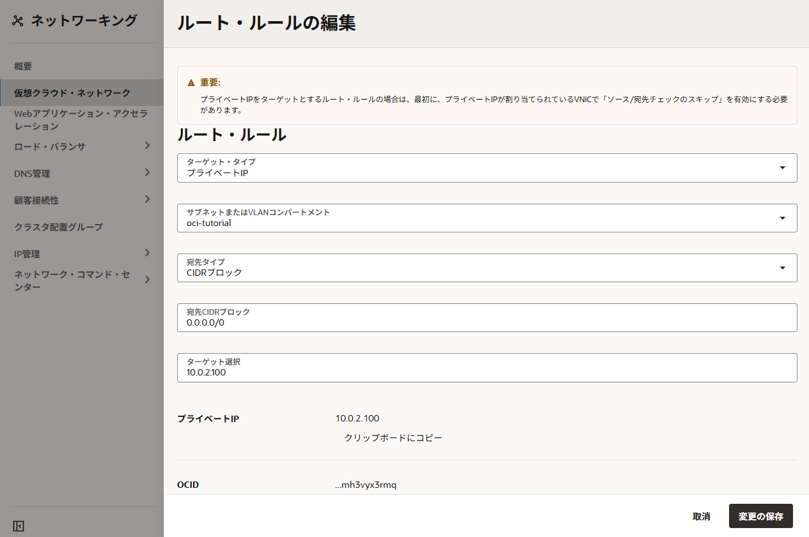

<br>

ここまでの設定により、現時点での環境は以下のようになっています。

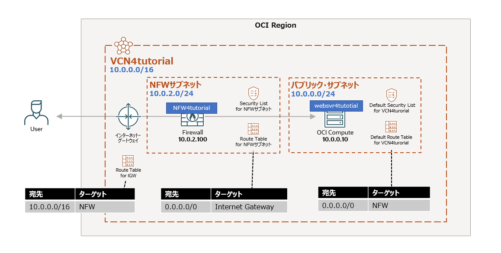

<br><br>


# 5. Network Firewall の IDP機能を確認する
## 5-1. テストサイトにアクセスする

Firewallインスタンスの作成が完了した後、webサーバーに配置したeicarファイルへのアクセスがFirewallによって防止されるかを確認します。  
この手順で、IDP（侵入防止機能）が正しく動作していることを検証します。

手順 3-3 と同様、ブラウザで以下の2つのURLにアクセスします。

まずは以下のURLでアクセスし、正しくテストページが表示されることを確認します。

```
http://<コンピュートのパブリックIP>/
```

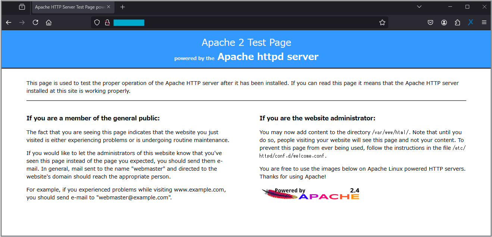

次に以下のURLにアクセスするとeicarファイルがFirewallによって検知され、アクセスが拒否されることを確認します。

```
http://<コンピュートのパブリックIP>/eicar.html
```

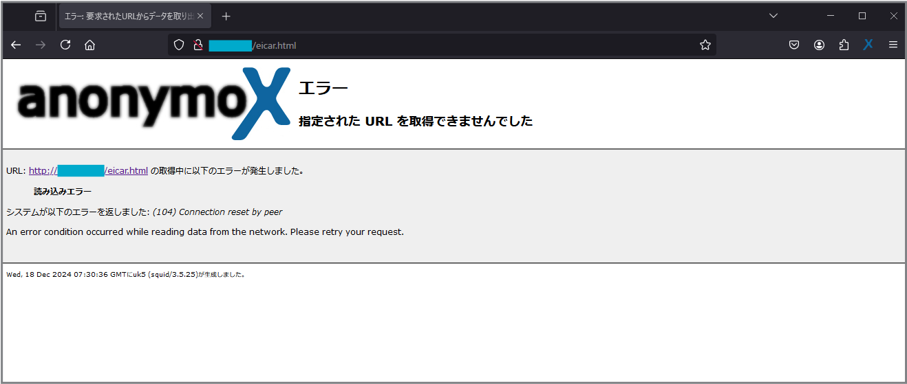

Network Firewallのセキュリティ・ルールが動作したかどうかは、インスタンスの詳細画面の「モニタリング」タブにアクセスした画面の「セキュリティ・ルール・ヒット数」から確認することができます。

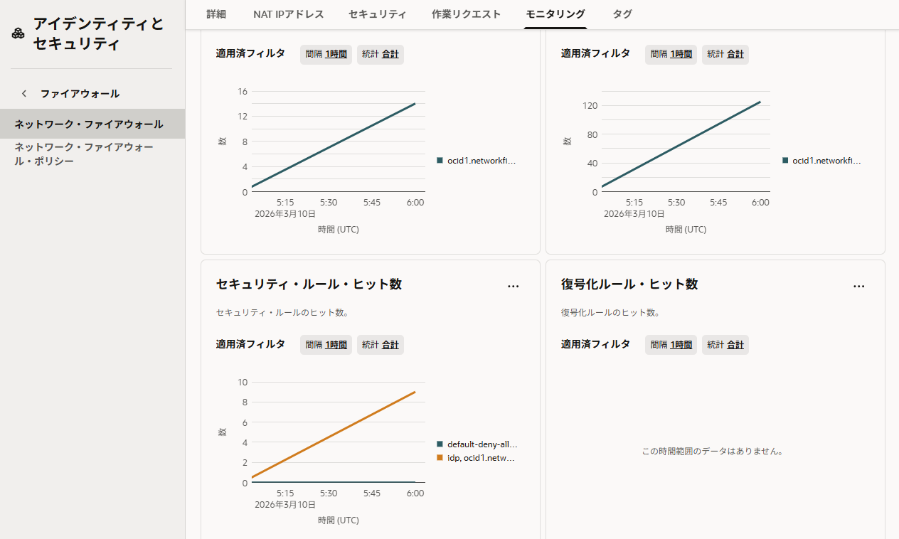


## 5-2. ログを確認する
Netowork Firewall の eicarファイルへのアクセス検知は、OCIのサービス・ログとしても確認ができます。

ログを確認するためには、Network Firewall インスタンスの詳細画面の「モニタリング」タブより検知した脅威のログ（Threat Log）を有効化します。

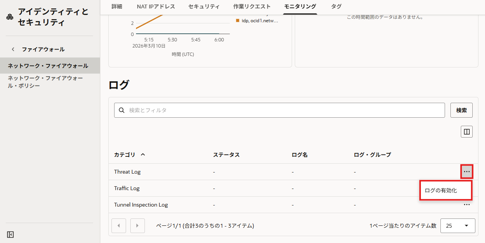

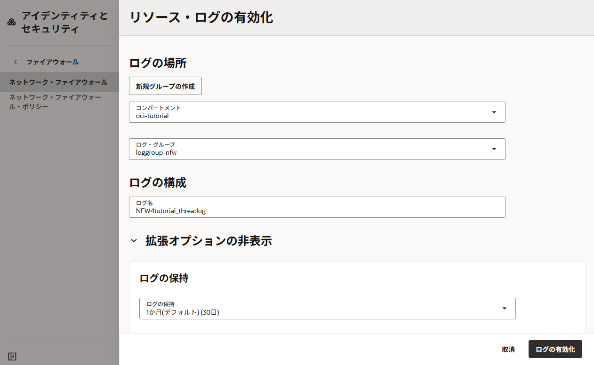

検知されたeicarファイルはこの脅威ログより、以下のように確認できます。

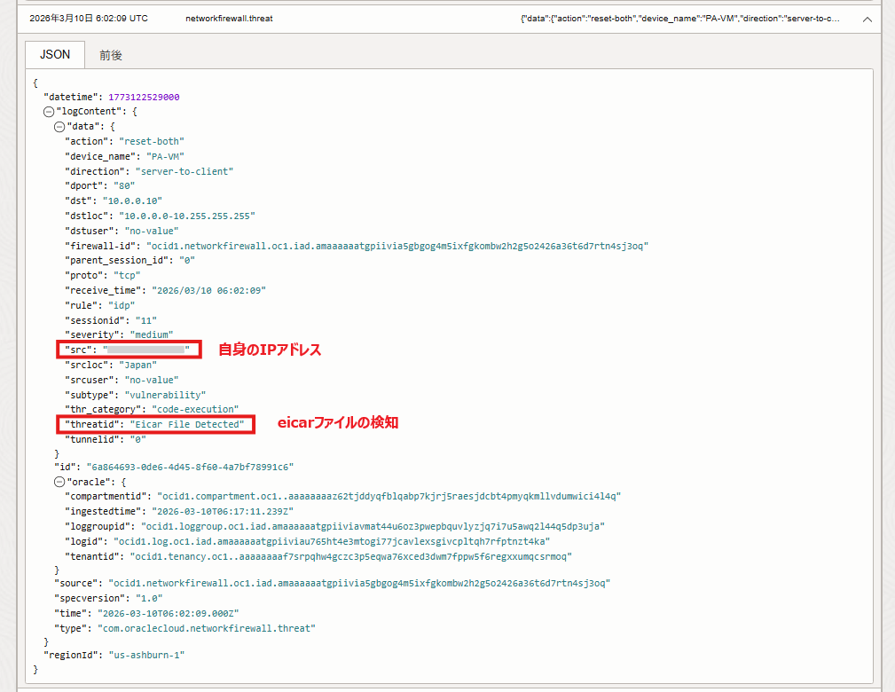

Network Firewalll の構築チュートリアルは以上です。

<br>

----

手順2-1 で作成したネットワーク・ファイアウォール・ポリシーでは、IDS/IPS、URLフィルタリング、SSLインスペクションなどの機能が設定できます。  
ファイアーウォール・ポリシーを設定を行い、Firewall の動作をより確認するステップとして、サービスリストやURLリストの動作検証を行うチュートリアル「[OCI Network Firewallの動作検証を行う](/ocitutorials/security/networkfirewall-policycheck)」もご用意しています。追加確認としてこちらもご参照ください。
