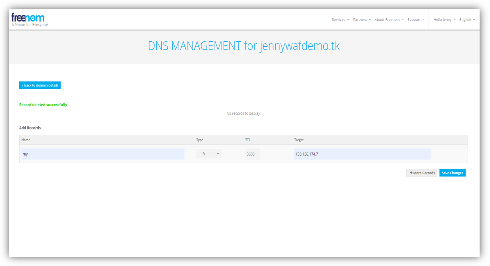
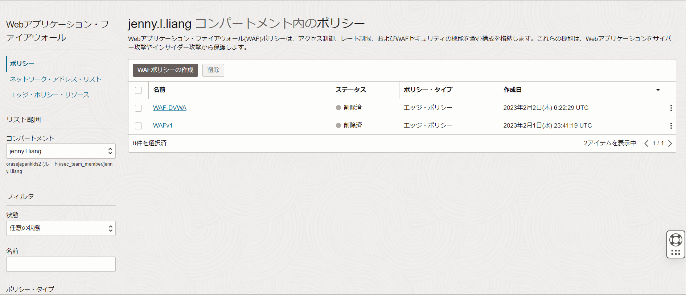

OCIにはエッジポリシーとWAFポリシーの2種類のWeb Application Firewallがあります。
本チュートリアルでは、OCI世界各リージョンのエッジに設定されているWAFサーバにデプロイするタイプの「エッジポリシー」を実際に作成して、Webアプリケーションへの攻撃を検知、防御しているところを確認します。

**所要時間：** 約90分

**前提条件：** 
+ ユーザーに必要なIAMポリシーが割り当てられていること。ポリシーの詳細は[ドキュメント](https://docs.oracle.com/ja-jp/iaas/Content/Identity/policyreference/wafpolicyreference.htm#Details_for_the_WAF_Service)をご参照ください。
+ Webアプリケーションのドメインを取得していること


**注意 :**
+ ※チュートリアル内の画面ショットについてはOracle Cloud Infrastructureの現在のコンソール画面と異なっている場合があります。
+ ※本チュートリアルはOCI上でコンピュートを立ち上げてWebサーバーをインストールするところから始めます。既に手元にWebサーバがインストールされ、ドメインが構成されている環境がある場合は手順4から始めてください。

<br>

## 1. コンピュートインスタンスの作成

OCIチュートリアル入門編「[その3-インスタンスを作成する](/ocitutorials/beginners/creating-compute-instance/)」を参考に、Webサーバ用のコンピュートインスタンスを1つ作成する。

<br>

## 2. Webサーバのインストールと起動

1. sshでインスタンスにアクセスする。  
インスタンスへのsshでのアクセス方法が不明な場合は、「[その3 - インスタンスを作成する](/ocitutorials/beginners/creating-compute-instance)」を参考にしてください。

2. Apache HTTPサーバーをインストールする。

    ```sh
    sudo yum -y install httpd
    ```

3. TCPの80番(http)および443番(https)ポートをオープンにする。

    ```sh
    sudo firewall-cmd --permanent --add-port=80/tcp
    sudo firewall-cmd --permanent --add-port=443/tcp
    ```

4. ファイアウォールを再ロードする。

    ```sh
    sudo firewall-cmd --reload
    ```

5. Webサーバーを起動する。

    ```sh
    sudo systemctl start httpd
    ```

6. ブラウザからWebサーバーにアクセスできることを確認する。  
ブラウザを開き、以下URLにアクセスしてApache Tomcatのトップページが表示されることを確認します。
    
    ```
    http://<WebサーバをインストールしたコンピュートインスタンスのIPアドレス>
    ```


<br>

## 3. DNSサーバの構成

### 3-1. DNSの設定（Aレコードの登録）
ドメインを取得したサイトでDNSの設定を開きます。
本チュートリアルの例では、ドメインを[Freenom](https://www.freenom.com/ja/index.html?lang=ja)で取得し、FreenomのDNSを編集します。
例えば、freenomでは「Services」→「My Domains」→取得したドメインの「Manage Domain」→「Manage Freenom DNS」からDNSの設定をすることができます。

DNSの設定から、WebサーバをインストールしたコンピュートインスタンスのIPアドレスをAレコードとして登録します。
- **`Name`** - 任意 例）my
- **`Type`** - A
- **`Target`** - WebサーバをインストールしたコンピュートインスタンスのIPアドレス




### 3-2. ドメインの動作確認
Aレコードを登録したドメインで、アプリケーションにアクセスできることを確認します。

```    
http://<Aレコードで登録したName>.<取得したドメイン>
```


<br>

## 4. ネットワークの設定
WAFサーバからのリクエストをWebサーバが受け付けられるように、WAFサーバのCIDRをWebサーバが配置されているVCNのサブネットのセキュリティリストにホワイトリストとして登録します。
CIDRの一覧は[ドキュメント](https://docs.oracle.com/ja-jp/iaas/Content/WAF/Concepts/gettingstarted.htm#secure)に記載があります。

OCIコンソール → ネットワーキング → 仮想クラウド・ネットワーク → コンピュートインスタンスを作成したVCN → セキュリティ・リスト → コンピュートインスタンスを作成したサブネットに割り当てられているセキュリティ・リストを選択します。
セキュリティ・リストの詳細画面にて、「イングレス・ルールの追加」ボタンをクリックし、WAFサーバのCIDRを登録します。


※ OCI CLIコマンドなどのAPIを使用することで一度に大量のCIDRを登録することも可能です。
OCI CLIの構成方法についてはOCIチュートリアル「[コマンドライン(CLI)でOCIを操作する](/ocitutorials/intermediates/using-cli/)」をご参照ください。
OCI CLIによるセキュリティ・リストの編集方法については[OCI CLI Command Reference](https://docs.oracle.com/en-us/iaas/tools/oci-cli/3.25.0/oci_cli_docs/cmdref/network/subnet/update.html)をご参照ください。

<br>

## 5. エッジポリシーの作成
OCIコンソール → アイデンティティとセキュリティ → Webアプリケーション・ファイアウォール → ポリシー → ポリシーの作成をクリックします。



表示されたWAFポリシーの作成画面の下に表示されている「非OCI Webアプリケーションを保護する必要がある場合は、ここでレガシー・ワークフローを使用します。」の青文字の”ここ”をクリックします。


エッジポリシーの作成画面にて、以下情報を入力し、「エッジポリシーの作成」ボタンをクリックします。
+ **`名前`** - 任意
+ **`プライマリ・ドメイン`** - WAFで保護したいドメインを入力
+ **`オリジン名`** - 任意
+ **`URI`** - WebサーバをインストールしたコンピュートインスタンスのIPアドレス

 

ポリシーの作成が完了すると、アクティブになります。

## 6. CNAMEレコードの登録
手順5で作成したエッジポリシーがアクティブになると、CNAMEが自動生成されます。
OCIコンソール → アイデンティティとセキュリティ → Web アプリケーション・ファイアウォール→ ポリシー→作成したポリシーをクリックします。
画面最上部に表示されているCNAMEレコードをメモします。
 


ドメインのDNSの設定に戻り、DNSにCNAMEレコード名と値を追加します。

- **`Name`** - エッジポリシー作成時に登録したドメインのレコード名 例）www
- **`Type`** - CNAME
- **`Target`** - エッジポリシー作成時に生成されたCNAMEレコード


<br>

## 7. 保護ルールの設定
本チュートリアルでは、シェルショックという脆弱性をつく攻撃手法を使用して、実際にWebアプリケーションを攻撃します。
本手順では、シェルショックの脆弱性への攻撃から保護する保護ルールを有効化します。

OCIコンソール → アイデンティティとセキュリティ → Web アプリケーション・ファイアウォール→ ポリシー→作成したポリシーをクリックします。
エッジポリシーの詳細画面から、「保護ルール」のタブを選択します。


画面左の「フィルタ」から、ルールID1000000を検索します。
表示された保護ルールのアクションを「ブロック」に変更します。


続いて、保護ルールの「設定」のタブから「ルール設定の編集」を開きます。


ルール設定の編集画面にて、ブロック・アクションを「エラー・ページの表示」に変更します。


エッジポリシーの詳細画面の最上部に表示されるバナーの「すべて公開」をクリックし、エッジポリシーの変更内容を公開します。


ポリシーは約30分程で再びアクティブになります。

## 8. WAFの動作確認
クライアントPCでターミナルを開き、以下コマンドを実行します。

```
$ curl <アプリケーションのURI>
```

curlでWebサーバにアクセスできることを確認します。


続いて、攻撃コマンドを実行します。

```
$ curl –A “()  { :;};echo Content-type text/plain;echo:/bin/cat/etc/passwd” <アプリケーションのURI>
```

コマンドを実行した結果、保護ルールで設定したエラー・メッセージが表示されることを確認します。


エッジポリシー詳細画面の「ログ」のタブから、攻撃がブロックされていることを確認します。


ログの詳細から、アクセス元のクライアントIPアドレス、国や地域、使用していたブラウザエージェントなどの詳細情報を確認することも可能です。

以上で、エッジポリシーの作成と動作確認は終了です。

エッジポリシーでは保護ルールの他にも、悪意のあるボットからのアクセスをブロックするボット管理の機能や、特定の国や地域からのアクセスをブロックするアクセス制御の機能などを提供しています。
是非他の保護機能も実際に触ってみてください。