OCIでは、OCI Load Balancerに直接デプロイするWAF、”WAFポリシー”と、お客様のアプリケーションのドメインに構築するWAF、”エッジポリシー”の2種類のWAFを提供しています。
本チュートリアルでは、「[OCIのLoad BalancerにアタッチするタイプのWeb Application Firewallを構築する](/ocitutorials/security/waf-v2-setup)」の続編として、有効化したログをOCIのログ分析サービス「Logging Analytics」に転送し、ログを可視化、分析する手順を紹介します。

**所要時間 :** 約20分

**前提条件 :**
+ 「[OCI Load Balancerに直接アタッチするタイプのWeb Application Firewallを構築する](/ocitutorials/security/waf-v2-setup)」を参考に、WAFポリシーの作成およびログの有効化（手順3）が完了していること
+ Logging Analyticsが有効化されていること
- OCIコンソールのメニューボタン→監視および管理→ログ・アナリティクス→ログ・エクスプローラを選択し、「ログ・アナリティクスの使用の開始」を選択することで、Logging Analyticsを有効化させることができます。

+ ユーザーがLogging Analyticsを使用するためのポリシーが作成されていること。ポリシーの詳細はOCIチュートリアル「[OCIのLogging AnalyticsでOCIの監査ログを可視化・分析する](https://oracle-japan.github.io/ocitutorials/intermediates/audit-log-analytics/)」もしくは、[ドキュメント](https://docs.oracle.com/ja-jp/iaas/Content/Identity/Reference/wafpolicyreference_topic-Details_for_WAF_Policies.htm#waf_policy_details)をご参照ください。
+ ユーザーがService Connectorを作成するためのポリシーが作成されていること。ポリシーの詳細は[ドキュメント](https://docs.oracle.com/ja-jp/iaas/Content/Identity/Reference/serviceconnectorhubpolicyreference.htm)をご参照ください。

**注意 :**
※チュートリアル内の画面ショットについてはOracle Cloud Infrastructureの現在のコンソール画面と異なっている場合があります。

 

## 1. ログ・グループの作成
WAFポリシーのログの転送先となるLogging Analyticsの「ログ・グループ」を作成します。
Logging Analyticsではログを「ログ・グループ」単位で管理することができます。

OCIコンソール画面左上のメニュー → 監視および管理 → ログ・アナリティクス → 管理 → ログ・グループ → 「ログ・グループの作成」ボタンをクリックします。

表示された「ログ・グループの作成」画面にて、任意のログ・グループ名を入力し、「作成」ボタンをクリックします。
 
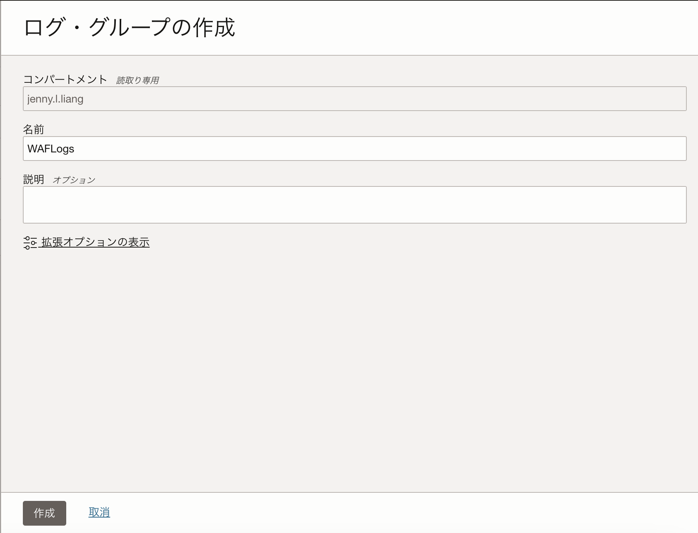

 

## 2. サービス・コネクタの作成
Service Connector Hubというサービスを使用して、Loggingサービスに保管されているWAFポリシーのログを、手順1で作成したLogging Analyticsのログ・グループに転送します。

Logging Analyticsでは200種類以上のログに対応したログの解析文（パーサー）があらかじめ定義されているため、解析文が事前定義されているログはLogging Analyticsに取り込むことですぐに分析することが可能です。
また、解析文が定義されていないログも、ユーザーがカスタムで解析文を作成することが可能です。

本チュートリアルで分析するWAFポリシーのログも解析文がオラクルによってあらかじめ定義されているので、ログをLogging Analyticsに転送します。

OCIコンソール画面左上のメニュー → 監視および管理 → ロギング → サービス・コネクタ → 「サービス・コネクタ」の作成ボタンをクリックします。

表示された「サービス・コネクタの作成」画面にて、以下項目を入力し、「作成」ボタンをクリックします。

+ **`コネクタ名`** - 任意 例）WAFLog Connector
+ **`説明`** - 任意 例）WAFログの転送
+ **`リソース・コンパートメント`** - WAFポリシーのログが保管されているLoggingサービスのコンパートメントを選択
+ **`ソース`** - ロギング
+ **`ターゲット`** - ログ・アナリティクス

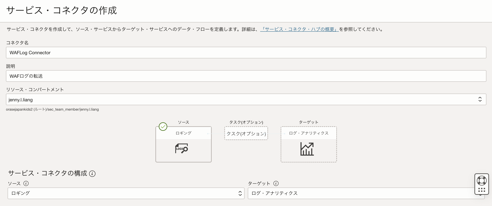

**ソースの構成**
+ **`ログ・グループ`** - WAFポリシーのログを有効化したLoggingサービスのログ・グループを選択
+ **`ログ`** - 有効化したWAFポリシーのログを選択

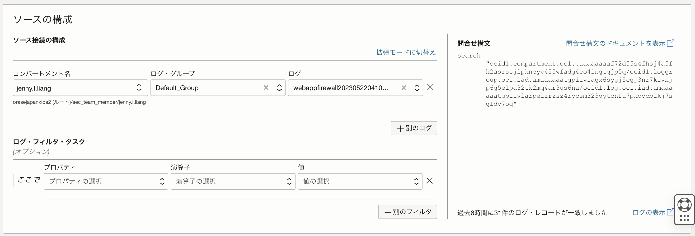

**ターゲットの構成**
+ **`コンパートメント`** - 手順1でLogging Analyticsのログ・グループを作成したコンパートメントを選択
+ **`ログ・グループ`** - 手順1で作成したログ・グループを選択
+ **このサービス・コネクタによるコンパートメント○○のログ・アナリティクスへの書き込みを許可するデフォルト・ポリシーを作成します** の「作成」ボタンをクリック
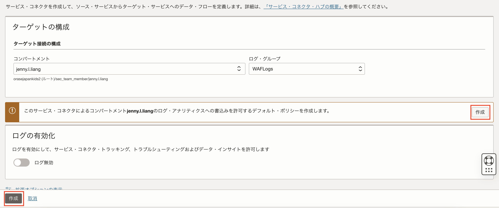

「サービス・コネクタの作成」画面一番下の「作成」ボタンをクリックしたら、以上でサービス・コネクタの作成は完了です。

 

## 3. WAFログのダッシュボード定義のインポート

本チュートリアルでは、カスタムで予め作成されたダッシュボード定義をエクスポートしたjsonファイルを、各自環境にインポートします。

※ログの出力フォーマットは変更する可能性があります。Github上にあるダッシュボード定義は2023年12月時点のWAFログに対応したものになります。  
WAFログのダッシュボード定義ファイルは以下Githubにあリます。

+ [ダッシュボード定義](https://github.com/jennylia3/oci-waf-tutorials/blob/main/WAF%20Dashboard%20-%20JP.json)

OCIコンソール画面左上のメニュー → 監視及び管理 → ログ・アナリティクス → ダッシュボードをクリックします。
ダッシュボード画面の「Import Dashboards」をクリックし、GitHubからダウンロードしたJSONファイルを選択します。
 

表示された「Import Dashboards」の画面にて、それぞれ以下を選択します。
+ **`Compartments for dashboards`** - 「Specify a compartment for all dashboards」を選択
+ **`Choose a Compartment`** - 手順1でロググループを作成したコンパートメントを選択
+ **`Compartments for saved searches`** - 「Specify a compartment for all saved searches」を選択
+ **`Choose a Compartment`** - 手順1でログ・グループを作成したコンパートメントを選択
 

以上の情報を入力したら、「Import」ボタンをクリックします。  
ダッシュボード画面にて、「WAF Dashboard」ダッシュボードが作成されていることを確認します。

 

## 4. ログの分析
OCIコンソール画面左上のメニュー → 監視および管理 → ログ・アナリティクス → ログ・エクスプローラーにて、「OCI WAF Logs」をクリックすると、WAFのログが一覧で表示されます。
 
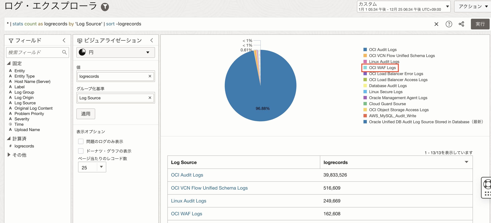

一覧で表示されたログコンテンツを更に拡張表示し、ログの解析文（ログ・パーサー）によってログの中身のフィールドが識別されていることを確認します。

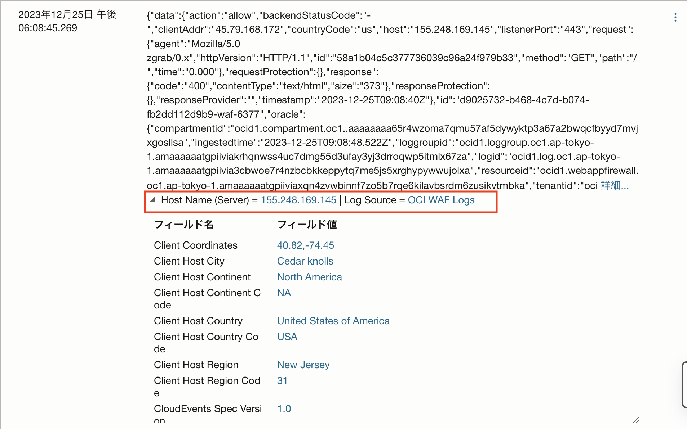

Logging Analyticsでは、解析文によって定義されている「フィールド」に基づいて、ログを可視化、分析することができます。

### 4-1. WAFへのアクセス元地域を世界地図で表示する（例1）
ビジュアライゼーションメニューのドロップダウンボックスをクリックし、地球儀のマークを選択します。
 
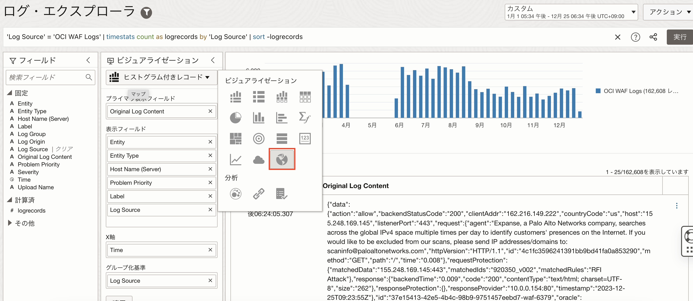

WAFへのアクセス元のクライアント情報を基に、世界地図上でどの国からアクセスがあったかを確認することができます。
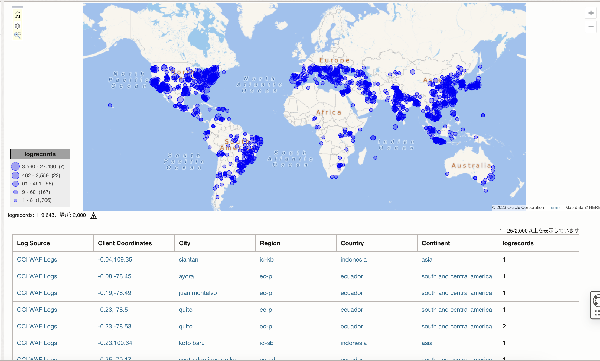

世界地図下に表示されているリストで、「logrecords」の隣の▼をクリックすると、リストをログレコード数の昇順/降順表示に切り替えることができます。  
以下スクリーンショットでは、アメリカのアリゾナ州からのアクセスが最も多いことが分かります。

 

### 4-2. WAFによるアクションを確認する（例2）
Logging Analyticsでは、WAFによって取られたアクションを「WAF Status Code」というフィールド名にて確認することができます。  
WAFを通過したリクエストのうち、WAFによって取られた各アクションの内訳を確認します。  

ビジュアライゼーションメニューのドロップダウンボックスをクリックし、円グラフのマークをクリックします。
 
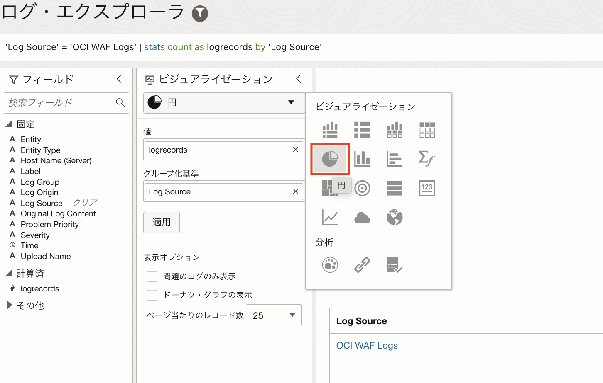

続いて、フィールドメニューの「その他」を拡張し、「WAF Status Code」の右に表示される3つの点をクリックします。  
「グループ化基準に追加」をクリックします。

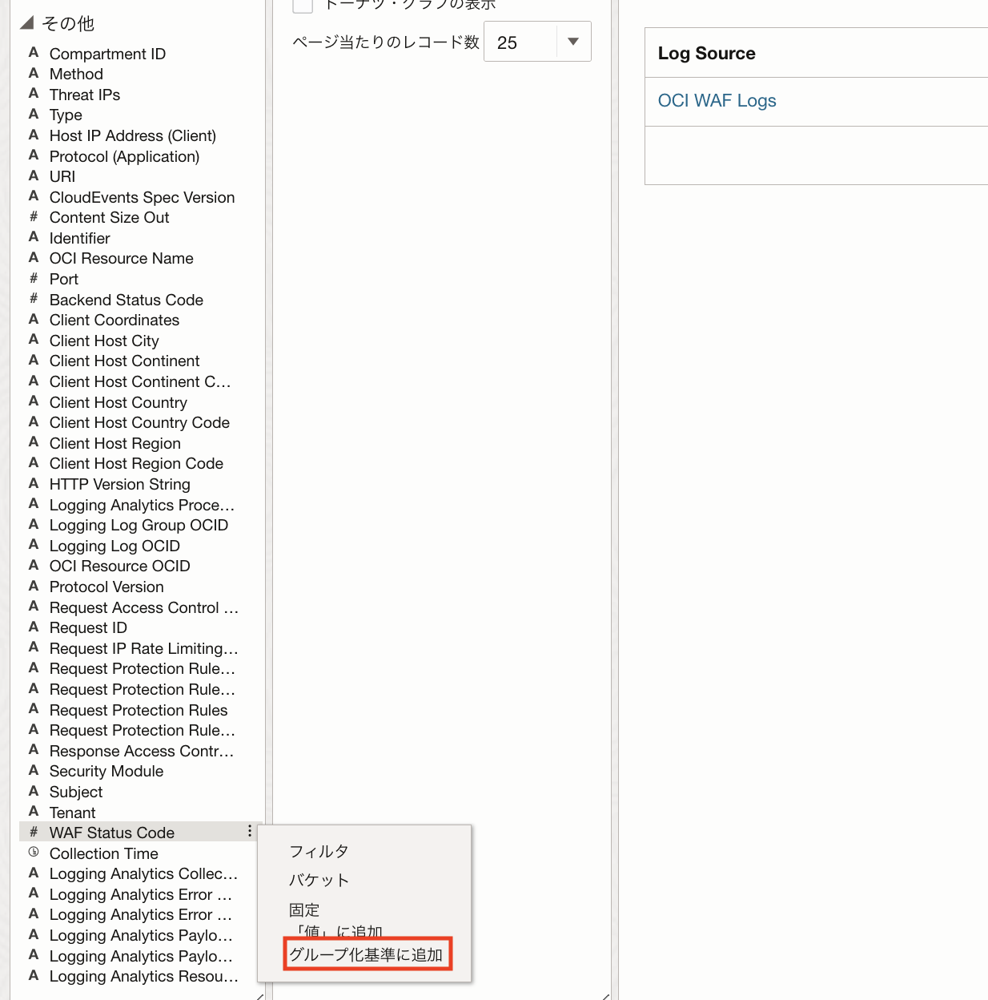

ビジュアライゼーションメニューの「グループ化基準」に「WAF Status Code」が追加されていることを確認したら、下の「適用」ボタンをクリックします。

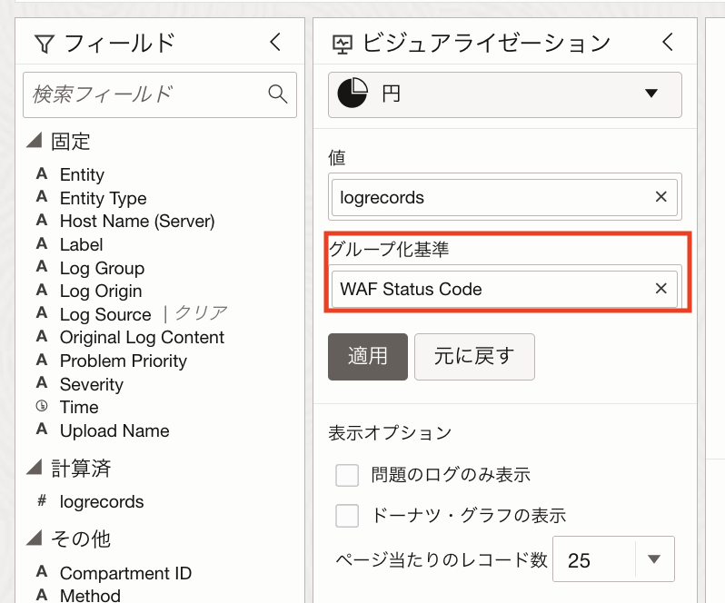

WAFのリクエスト全体でWAFによるレスポンスコードの内訳が表示されます。  
下のスクリーンショットの例では、HTTPコード400が最も多く返却されていることが分かります。

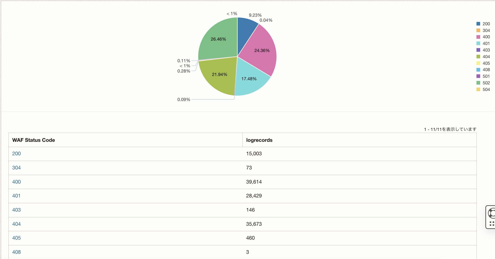

円グラフの中から特定のステータスコードをクリックすることで、更にログを絞り込むことも可能です。

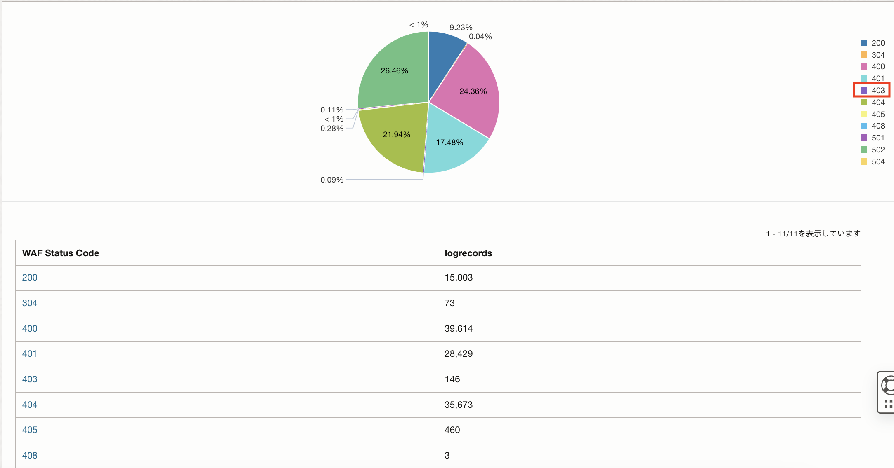
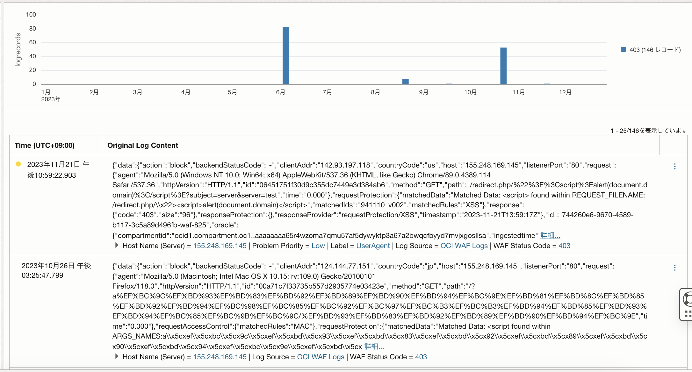

 

### 4-3. ダッシュボードを利用する（例3）
OCIコンソール画面左上のメニュー → 監視および管理 → ログ・アナリティクス → ダッシュボードを選択し、手順3でインポートしたダッシュボードを選択します。
 

以下のようなダッシュボードが表示されます。
 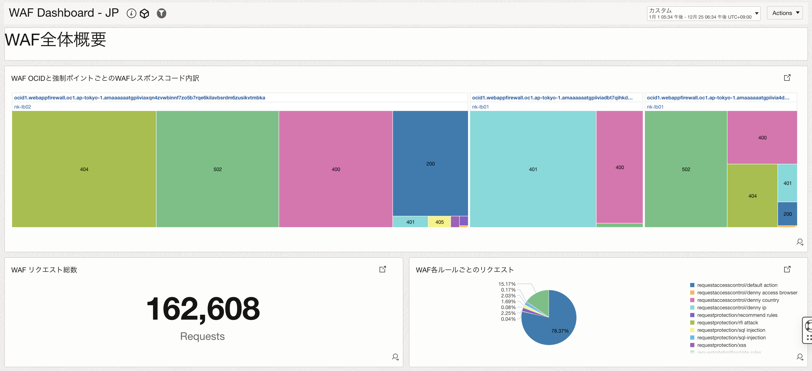

WAFのダッシュボードは大きく以下の3つのセクションに分かれています。
+ WAF全体概要
+ WAFアクセス制限&レート制限
+ WAF保護ルール

WAF全体概要では、WAFを通過したリクエストに関する情報を可視化することができます。

+ **例1. WAF OCIDと強制ポイントごとのWAFレスポンスコード内訳**
 

+ **例2. WAFソースIPアドレス Top10**  
WAFを通過したリクエストのクライアントIPアドレスのTop10を円グラフ、リストで確認することができます。

+ **例3. WAFアクセス数 Top10 By 国コード**  
WAFを通過したリクエストのクライアントの位置情報を基に、最もアクセス数の多い国Top10を確認することができます。

また、必要に応じてダッシュボードの中身は編集することができます。
ログ・エクスプローラーにてダッシュボードに追加したい検索結果を表示し、画面左上の「アクション」→ 「名前をつけて保存」をクリックします。
 
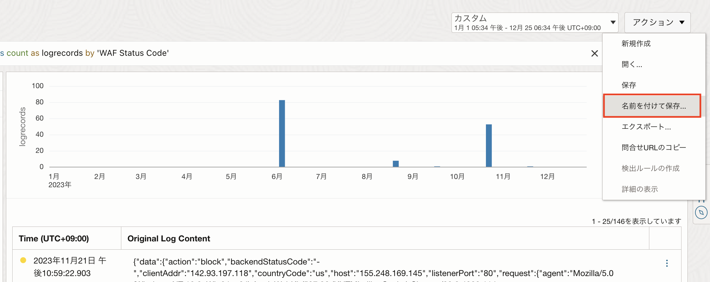

「検索の保存」画面にて、任意の検索名を入力し「ダッシュボードに追加」にチェックを入れます。
追加先のダッシュボードを選択し、「保存」することで既存のダッシュボードに新しいビューを追加することができます。

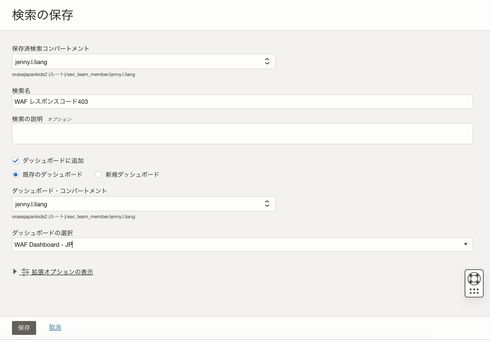

また、ダッシュボード画面の左上の「Action」から、「Edit」を選択することで、ダッシュボードの中身のウィジェットを削除したり、位置を編集することも可能です。
 
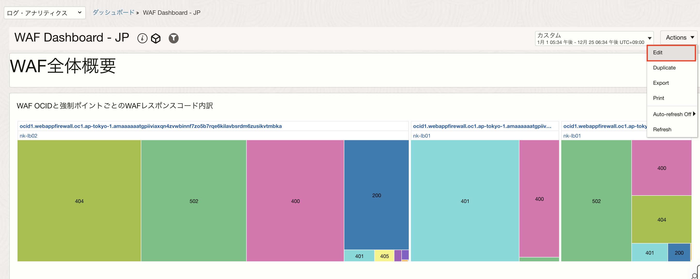

以上で、OCI WAFのログをLogging Analyticsに転送して分析する手順は完了です。
是非、ダッシュボードを実運用に合わせてカスタマイズしてご活用ください。

