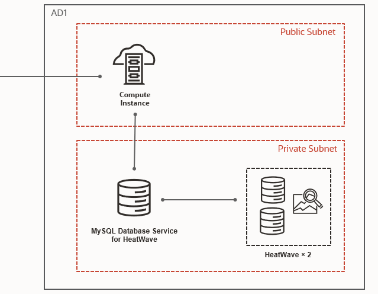
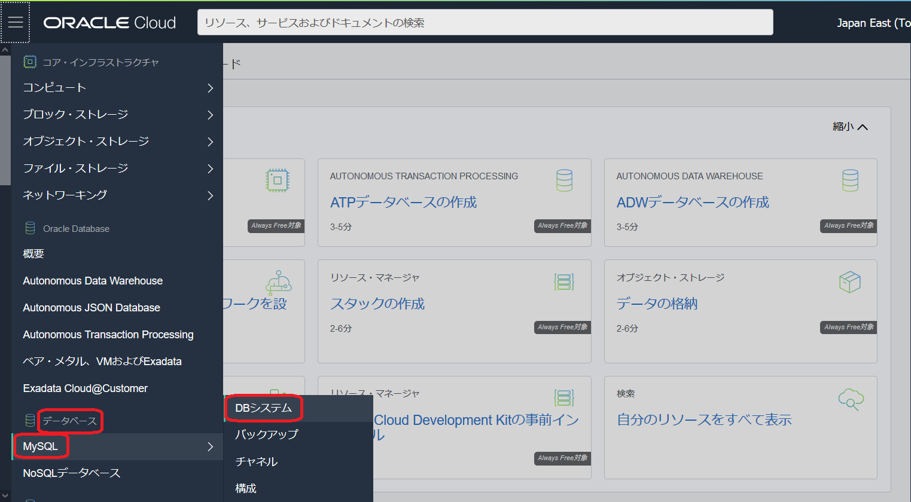
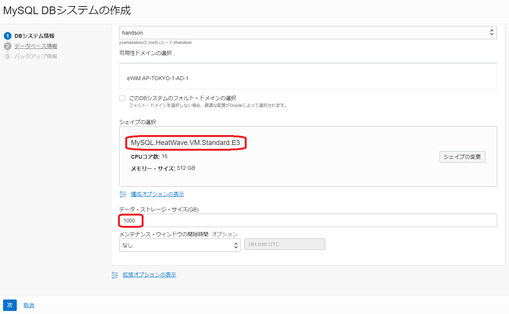
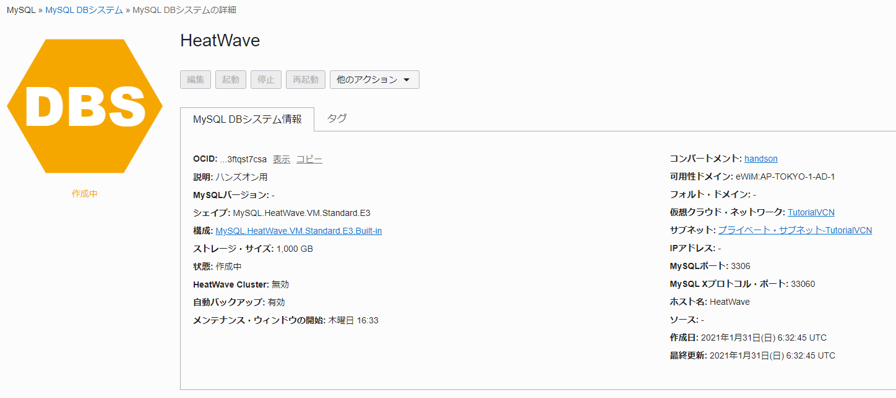
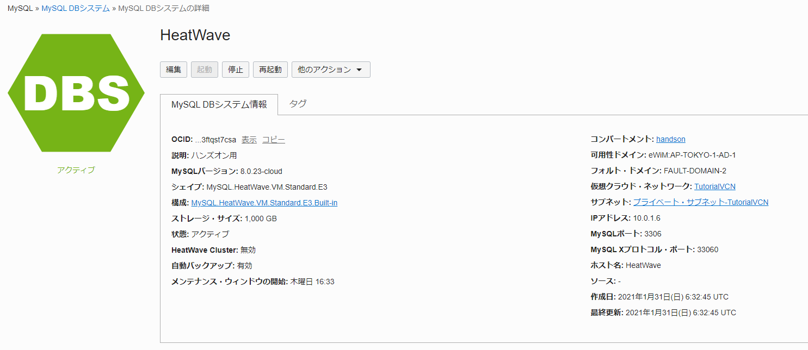
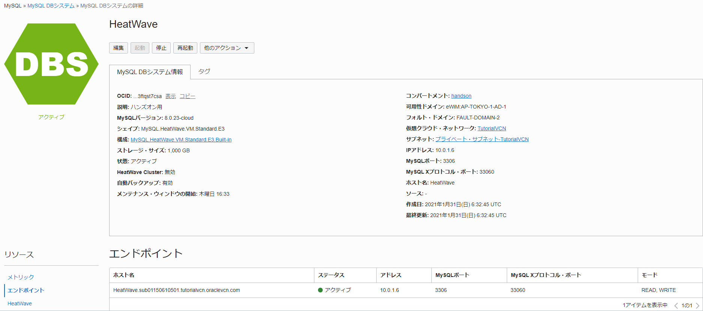
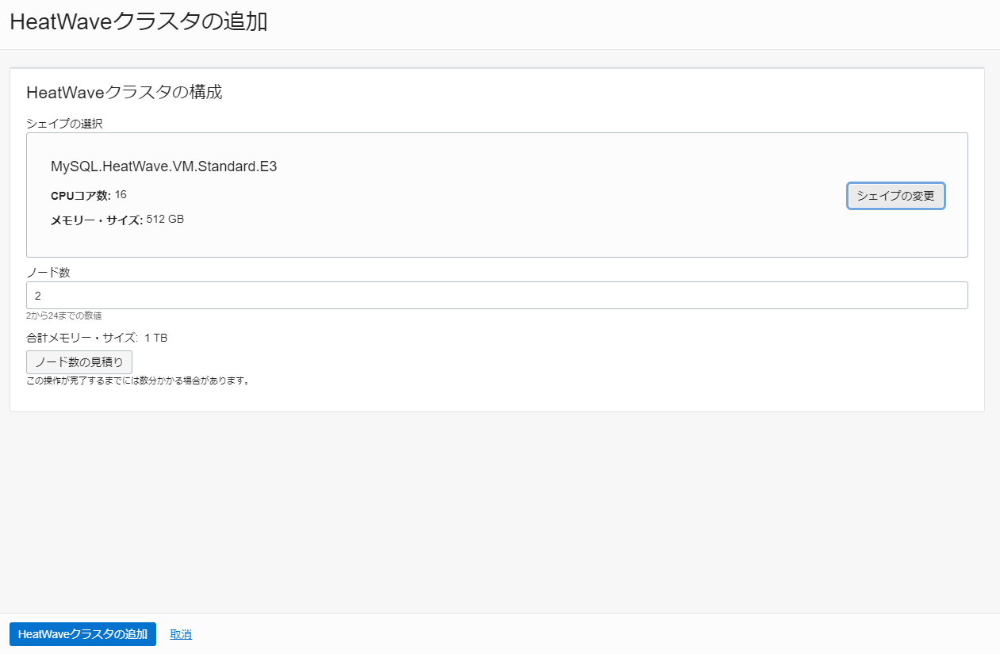

Oracle Cloud Infrastructure(OCI) では、HeatWaveというデータ分析処理を高速化できるMySQL Database Services(MDS)専用のクエリー・アクセラレーターが使用できます。HeatWaveもMDSと同じく、Always Freeの対象ではないため使用するためにはクレジットが必要ですが、トライアルアカウント作成時に付与されるクレジットでも使用可能です。

このチュートリアルでは、コンソール画面からHeatWaveを構成し、MySQLクライアントからサンプルデータベースを構成してHeatWaveを利用する手順を説明します。

**所要時間 :** 約40分 (約25分の待ち時間含む)

**前提条件 :**

1. Oracle Cloud Infrastructure の環境(無料トライアルでも可) と、管理権限を持つユーザーアカウントがあること
2. [OCIコンソールにアクセスして基本を理解する - Oracle Cloud Infrastructureを使ってみよう(その1)](../getting-started/)を完了していること
3. [クラウドに仮想ネットワーク(VCN)を作る - Oracle Cloud Infrastructureを使ってみよう(その2)](../creating-vcn/)を完了していること
4. [インスタンスを作成する - Oracle Cloud Infrastructureを使ってみよう(その3)](https://community.oracle.com/tech/welcome/discussion/4474256/)を完了していること
5. [クラウドでMySQL Databaseを使う(その9)](https://oracle-japan.github.io/ocitutorials/beginners/creating-mds/)を完了していること

**注意 :** チュートリアル内の画面ショットについては Oracle Cloud Infrastructure の現在のコンソール画面と異なっている場合があります

<br>

**目次：**

- [1. HeatWaveとは?](#anchor1)
- [2. HeatWave構成時の注意事項](#anchor2)
- [3. HeatWaveの構成(HeatWave用MDSの構成)](#anchor3)
- [4. HeatWaveの構成(HeatWaveノードの追加)](#anchor4)
- [5. サンプルデータベースの構築](#anchor5)
- [6. HeatWaveへのデータロード](#anchor6)
- [7. HeatWaveの確認](#anchor7)

<br>

<a id="anchor1"></a>

# 1. HeatWaveとは?

HeatWaveとはOCIでのみ使えるデータウェアハウスサービスです。MySQL Database Serviceの拡張サービスとして提供されており、インメモリで並列処理することにより分析系のSQLも高速に実行できます。MySQL 8.0ベースのサービスとなっていますので、今までMySQLで実行していたSQLをそのまま使えます。また、レプリケーションを構成してオンプレミスのMySQL 5.7、8.0からETLを使わずにデータを連携することもできます。


<a id="anchor2"></a>

# 2. HeatWave構成時の注意事項

HeatWaveを構成する前に、使用する環境のサービスリミットを確認し、後述する最小構成を満たしていることを確認して下さい。サービスリミットが最小構成を満たしてい無い場合は、事前にサービスリミットの引上げ申請を出して下さい[^1]。

[^1]: HeatWaveのデフォルトサービスリミットは以前は0に設定されていました。新しくアカウントを作成した場合はデフォルトサービスリミットが変更されていて最初から使える状態になっていると思われますが、念のため使用している環境でサービスリミットが後述する最小構成を満たしていることを確認して下さい。

本チュートリアルで構成するHeatWaveの構成図は以下のようになります。HeatWaveを構成する時は、HeatWave専用のMySQL Database Serviceを構成し、そこにHeatWaveのノードを追加します。HeatWaveノードはバックグラウンドで動作するため、アプリケーションからの接続先はMySQL Database Serviceになります。また、HeatWaveノードの最小台数は2台、最大台数は24台となっています。HeatWaveノードではインメモリでデータを保持し、1台あたり約400GBのデータを保持できます。

<div align="center">

</div>
<br>


## サービスリミットの確認＆引上げリクエスト送信方法

1. コンソール左上のメニューをクリックしてメニューを表示し、一番下までスクロールします。**ガバナンス** → **制限、割当ておよび使用状況** をクリックします。

    <div align="center">
    
    </div>
    <br>


2. サービスは **MySQL** 、スコープは **XXXX:AP-TOKYO-1-AD-1** を選択します(東京リージョンを使用している場合)。"XXXX"部分は固有の文字列になります。表示された画面で「MySQL Database for HeatWave VM.Standard.E3 Nodes Count」が1以上、「MySQL HeatWave VM.Standard.E3 Nodes Count」が2以上になっていることを確認します。

    <div align="center">
    
    </div>
    <br>


3. サービスリミットが最小構成を満たしていない場合は、右上の **サービス制限の引上げ** リンクをクリックし、必要事項を記入して **リクエストの送信** ボタンをクリックすることでサービス制限の引上げリクエストを登録できます。作業完了の連絡は連絡先に入力したメールアドレスにメールで通知されます。

    <div align="center">
    
    </div>
    <br>


<a id="anchor3"></a>

# 3. HeatWaveの構成(HeatWave用MDSの構成)

HeatWaveを構成する時は、HeatWave専用のMySQL Database Service(MDS)を構成し、そこにHeatWaveのノードを追加します。そのため、まずはHeatWave専用のシェイプを選択してMDSを構成します。
<br>

1. コンソールメニューから **データベース** → **MySQL** → **DBシステム** を選択します。
    <div align="center">
    
    </div>
    <br>

2. **MySQL DBシステムの作成** ボタンを押します。この際、左下の **リスト範囲** でリソースを作成したいコンパートメントを選択していることを確認してください。ここでは「handson」コンパートメントを使用しています。
    <div align="center">
    
    </div>
    <br>

3. 立ち上がった **MySQL DBシステムの作成** ウィンドウの **① DBシステム情報** のステップで、以下の項目を入力します。また、 **シェイプの変更** をクリックして表示されたウインドウから **MySQL.HeatWave.VM.Standard.E3** を選択し、**シェイプの選択** をクリックします。その後元のウインドウに戻って**次** ボタンを押します。

    - **名前** - 任意の名前を入力します。ここでは「HeatWave」と入力しています。
    - **説明** - このMDSの説明を入力します。ここでは「ハンズオン用」と入力しています。(入力は任意です)
    - **データ・ストレージ・サイズ(GB)** - データ用のストレージサイズを入力します。ここでは1000GB確保するために「1000」と入力しています。

    <div align="center">
    
    </div>
    <br>

    <div align="center">
    
    </div>
    <br>

    <div align="center">
    
    </div>
    <br>


4. **② データベース情報** のステップで、以下の項目を入力し **次** ボタンを押します

    - **ユーザー名** - MySQL Databaseの管理者ユーザーのユーザー名を指定します。ここでは「root」と入力しています。(セキュリティの観点からは任意のユーザー名を指定することを推奨します)
    - **パスワード** - MySQL Databaseの管理者ユーザーのパスワードを指定します。パスワードは8文字から32文字までの長さで、大文字、小文字、数字および特殊文字をそれぞれ1つ以上含める必要があります。
    - **パスワードの確認** - パスワードを再入力します。
    - **ホスト名** - 任意のホスト名を入力します。ここでは「HeatWave」と入力しています。
    <div align="center">
    
    </div>
    <br>

5. **③ バックアップ情報** のステップで、何も変更せずに **作成** ボタンを押します。
    <div align="center">
    
    </div>
    <br>

6. MDSが**作成中**になるのでしばらく待ちます。概ね15分程度で作成が完了しステータスが**アクティブ**に変わります。
    <div align="center">
    
    
    </div>
    <br>

7. ページ左下の **リソース** → **エンドポイント** をクリックして、ホスト名、IPアドレスを確認しておきます。
    <div align="center">
    
    </div>
    <br>


<a id="anchor4"></a>

# 4. HeatWaveの構成(HeatWaveノードの追加)

1. HeatWave用のMDSにHeatWaveノードを追加します。HeatWave用のMDSを選択した状態で左下のメニューより **HeatWave** をクックします。その後、**HeatWaveクラスタの追加** をボタンを押します。
    <div align="center">
    
    </div>
    <br>

2. **シェイプの変更** ボタンを押します。表示されたウインドウでHeatWave用のシェイプである**MySQL.HeatWave.VM.Standard.E3** を選択し、**シェイプの選択** ボタンを押します。元のウインドに戻ってシェイプが変更されていることを確認し、**HeatWaveクラスタの追加** ボタンをクリックします。
(既にMDSにデータをロードしている状態であればここで**ノード数の見積もり** ボタンを押すことで必要なHeatWaveノード数を見積もることができますが、今回は最小構成で構成するためノード数は2から変更せずに次に進みます)
   
    <div align="center">
    
    <br>
    <br>
    
    <br>
    <br>
    
    </div>
<br>
   
3. HeatWaveノードが作成中になるのでしばらく待ちます。概ね10分程度でHeatWaveノードが追加されます。
    <div align="center">
    
    
    </div>
    <br>


<a id="anchor5"></a>

# 5. サンプルデータベースの構築

MDSにサンプルデータベースを構築し、HeatWaveノードへデータをロードします。サンプルデータベースはMySQL Developer Zoneで公開されている[Example Database](https://dev.mysql.com/doc/index-other.html#rowid-5)の中でデータ量が多いemployeeデータベースを利用します。

employeeデータベースはGitHubで公開されているため、リポジトリをクローンしてSQLスクリプトをダウンロードし、サンプルデータベースを構築します。

<br>
1. [インスタンスを作成する - Oracle Cloud Infrastructureを使ってみよう(その3)](https://community.oracle.com/tech/welcome/discussion/4474256/)で作成したコンピュート・インスタンスに接続し、以下のコマンドを実行してGitをインストールし、employeeデータベースのリポジトリをクローンします。

    ```
    sudo yum install git
    git clone https://github.com/datacharmer/test_db
    ```
<br>
2. ダウンロードされた**test_db** フォルダ内のSQLスクリプトを実行してサンプルデータベースを構築します。test_dbフォルダに移動後、mysqlコマンドラインクライアントを使ってMDSへ接続し、sourceコマンドを使ってSQLスクリプトを実行します。実行例は以下の通りです。ユーザー名はMDSの管理者ユーザー名に、ホスト名は確認したホスト名に置き換えて下さい。(“-u”オプションでユーザー名を、”-h”オプションでホスト名を指定します)

    ```
    [opc@testvm1 ~]$ cd test_db
    [opc@testvm1 test_db]$ mysql -u root -p -h HeatWave.sub01150610501.tutorialvcn.oraclevcn.com
Enter password: 
    Welcome to the MySQL monitor.  Commands end with ; or \g.
    Your MySQL connection id is 39
    Server version: 8.0.23-cloud MySQL Enterprise - Cloud
    
    Copyright (c) 2000, 2020, Oracle and/or its affiliates. All rights reserved.
    
    Oracle is a registered trademark of Oracle Corporation and/or its
affiliates. Other names may be trademarks of their respective
owners.
    
    Type 'help;' or '\h' for help. Type '\c' to clear the current input statement.
    
    mysql> source employees.sql
    Query OK, 0 rows affected, 1 warning (0.08 sec)
    
    Query OK, 1 row affected (0.01 sec)
    
    Database changed
    +-----------------------------+
    | INFO                        |
    +-----------------------------+
    | CREATING DATABASE STRUCTURE |
    +-----------------------------+
    1 row in set (0.00 sec)
    
    Query OK, 0 rows affected, 6 warnings (0.01 sec)
    
    <中略>
    Query OK, 7671 rows affected (0.12 sec)
    Records: 7671  Duplicates: 0  Warnings: 0
    
    +---------------------+
    | data_load_time_diff |
    +---------------------+
    | 00:01:11            |
    +---------------------+
    1 row in set (0.00 sec)
    
    mysql> 
    ```
<br>


3. employeesデータベース内にテーブルが作成されていることを確認します。
    ```
    mysql> SHOW DATABASES;
    +--------------------+
    | Database           |
    +--------------------+
    | employees          |
    | information_schema |
    | mysql              |
    | performance_schema |
    | sys                |
    +--------------------+
    5 rows in set (0.00 sec)
    
    mysql> USE employees;
    Reading table information for completion of table and column names
    You can turn off this feature to get a quicker startup with -A
    
    Database changed
    mysql> SHOW TABLES;
    +----------------------+
    | Tables_in_employees  |
    +----------------------+
    | current_dept_emp     |
    | departments          |
    | dept_emp             |
    | dept_emp_latest_date |
    | dept_manager         |
    | employees            |
    | salaries             |
    | titles               |
    +----------------------+
    8 rows in set (0.08 sec)
    ```


4. 部門毎の合計給与額を求める以下のSQLを実行して、MDSでの実行時間を確認しておきます。この例では、3.26秒かかりました。
    ```
    mysql> SELECT departments.dept_name,SUM(salaries.salary) AS sum_salaries
        ->   FROM employees JOIN salaries JOIN dept_emp JOIN departments
        ->     ON employees.emp_no=salaries.emp_no
        ->     AND employees.emp_no=dept_emp.emp_no
        ->     AND dept_emp.dept_no=departments.dept_no
        ->   GROUP BY departments.dept_name
        ->   ORDER BY sum_salaries DESC;
    
    +--------------------+--------------+
    | dept_name          | sum_salaries |
    +--------------------+--------------+
    | Development        |  48179456393 |
    | Production         |  41554438942 |
    | Sales              |  40030089342 |
    | Marketing          |  13725425266 |
    | Customer Service   |  13143639841 |
    | Research           |  11969730427 |
    | Finance            |  11650834677 |
    | Quality Management |  10865203635 |
    | Human Resources    |   9363811425 |
    +--------------------+--------------+
    9 rows in set (3.26 sec)
    ```
<br>


<a id="anchor6"></a>

# 6. HeatWaveへのデータロード

HeatWaveを使用する時には、事前に対象テーブルのデータをMDSからHeatWaveにロードする必要があります。HeatWaveにデータをロードした後は、MDSでデータを変更すると自動的に変更が伝搬されるため、この作業は新しくテーブルを作成した時や初回のデータロード時、HeatWaveノードの再起動時のみ行う必要があります。(HeatWaveノードの再起動時は以下のステップ2のみが必要になります)
<br>

1. ALTER TABLE文を使い、employeesデータベース内のテーブルに対して**SECONDARY_ENGINE=RAPID** を定義します[^2]。current_dept_emp と dept_emp_latest_date はビューであるため、これ以外の6テーブルについて実行します。

[^2]: HeatWaveの根幹をなす技術はOracle社の研究開発部門であるOracle LabsのProject RAPIDの成果を活用しているため、RAPIDという名称が使われています。

    ```
    mysql> ALTER TABLE employees.departments SECONDARY_ENGINE=RAPID;
    mysql> ALTER TABLE employees.dept_emp SECONDARY_ENGINE=RAPID;
    mysql> ALTER TABLE employees.dept_manager SECONDARY_ENGINE=RAPID;
    mysql> ALTER TABLE employees.employees SECONDARY_ENGINE=RAPID;
    mysql> ALTER TABLE employees.salaries SECONDARY_ENGINE=RAPID;
    mysql> ALTER TABLE employees.titles SECONDARY_ENGINE=RAPID;
    ```
<br>
2. **ALTER TABLE テーブル名 SECONDARY_LOAD;** を実行し、データをHeatWaveノードにロードします。

    ```
    mysql> ALTER TABLE employees.departments SECONDARY_LOAD;
    mysql> ALTER TABLE employees.dept_emp SECONDARY_LOAD;
    mysql> ALTER TABLE employees.dept_manager SECONDARY_LOAD;
    mysql> ALTER TABLE employees.employees SECONDARY_LOAD;
    mysql> ALTER TABLE employees.salaries SECONDARY_LOAD;
    mysql> ALTER TABLE employees.titles SECONDARY_LOAD;
    ```
<br>


<a id="anchor7"></a>

# 7. HeatWaveの確認

先ほど実行したSQLを再度実行して、HeatWaveでの実行時間を確認します。この例では、0.13秒で実行出来ていますので、約25倍高速化されています。この例で検索している対象のデータ量は約120MBと大きくありませんが、この程度のデータ量でも顕著に性能が向上しています。

    ```
    mysql> SELECT departments.dept_name,SUM(salaries.salary) AS sum_salaries
        ->   FROM employees JOIN salaries JOIN dept_emp JOIN departments
        ->     ON employees.emp_no=salaries.emp_no
        ->     AND employees.emp_no=dept_emp.emp_no
        ->     AND dept_emp.dept_no=departments.dept_no
        ->   GROUP BY departments.dept_name
        ->   ORDER BY sum_salaries DESC;
    +--------------------+--------------+
    | dept_name          | sum_salaries |
    +--------------------+--------------+
    | Development        |  48179456393 |
    | Production         |  41554438942 |
    | Sales              |  40030089342 |
    | Marketing          |  13725425266 |
    | Customer Service   |  13143639841 |
    | Research           |  11969730427 |
    | Finance            |  11650834677 |
    | Quality Management |  10865203635 |
    | Human Resources    |   9363811425 |
    +--------------------+--------------+
    9 rows in set (0.13 sec)
    ```
<br>
なお、HeatWaveが使われるSQLかどうかは、EXPLAINで実行計画を取ることで確認出来ます。HeatWaveを使用する場合は **Extra列** に **Using secondary engine RAPID** と表示されます。

    ```
    mysql> EXPLAIN SELECT departments.dept_name,SUM(salaries.salary) AS sum_salaries
        ->   FROM employees JOIN salaries JOIN dept_emp JOIN departments
        ->   ON employees.emp_no=salaries.emp_no
        ->   AND employees.emp_no=dept_emp.emp_no
        ->   AND dept_emp.dept_no=departments.dept_no
        ->   GROUP BY departments.dept_name
        ->   ORDER BY sum_salaries DESC;
    +----+-------------+-------------+------------+------+---------------+------+---------+------+---------+----------+--------------------------------------------------------------------------+
    | id | select_type | table       | partitions | type | possible_keys | key  | key_len | ref  | rows    | filtered | Extra                                                                    |
    +----+-------------+-------------+------------+------+---------------+------+---------+------+---------+----------+--------------------------------------------------------------------------+
    |  1 | SIMPLE      | departments | NULL       | ALL  | NULL          | NULL | NULL    | NULL |       9 |   100.00 | Using temporary; Using filesort; Using secondary engine RAPID            |
    |  1 | SIMPLE      | dept_emp    | NULL       | ALL  | NULL          | NULL | NULL    | NULL |  331143 |    10.00 | Using where; Using join buffer (hash join); Using secondary engine RAPID |
    |  1 | SIMPLE      | employees   | NULL       | ALL  | NULL          | NULL | NULL    | NULL |  299157 |    10.00 | Using where; Using join buffer (hash join); Using secondary engine RAPID |
    |  1 | SIMPLE      | salaries    | NULL       | ALL  | NULL          | NULL | NULL    | NULL | 2830954 |    10.00 | Using where; Using join buffer (hash join); Using secondary engine RAPID |
    +----+-------------+-------------+------------+------+---------------+------+---------+------+---------+----------+--------------------------------------------------------------------------+
    4 rows in set, 1 warning (0.09 sec)
    ```
<br>
また、オプティマイザヒントを使うことで、HeatWaveを使うかどうかを明示的に指定することもできます。ヒント句は以下の3種類あります。

* SET_VAR(use_secondary_engine=ON) : HeatWaveを使う。HeatWaveが使えない場合(HeatWaveノードの停止時、HeatWaveにデータをロードしていない場合など)や、オプティマイザがHeatWaveを使わない方が効率的と判断した場合はMDSで処理する。
* SET_VAR(use_secondary_engine=OFF) : HeatWaveを使わない。
* SET_VAR(use_secondary_engine=FORCED) : 強制的にHeatWaveを使う。HeatWaveが使えない場合はSQLがエラーになる。

<br>
ヒント句は以下のように、**SELECT** 句の後にSQL文のコメントとして埋め込んで使用します。SQL文の文法的にはコメントになっているため、スペルミスをするなどでヒント句の指定を間違ってもSQLとしてはエラーにならないので注意して下さい。("Unresolved name 'XXXXX' for SET_VAR hint" という警告は発生します)

    ```
    SELECT /*+ SET_VAR(use_secondary_engine=ON) */ departments.dept_name,SUM(salaries.salary) <略>
    
    SELECT /*+ SET_VAR(use_secondary_engine=OFF) */ departments.dept_name,SUM(salaries.salary) <略>
    
    SELECT /*+ SET_VAR(use_secondary_engine=FORCED) */ departments.dept_name,SUM(salaries.salary) AS sum_salaries <略>
    ```
<br>


これで、この章の作業は終了です。

この章ではHeatWaveを構成し、サンプルデータベースを構築してMDSと性能比較をしました。サンプルデータベースの分析対象データは約120MBと大きなサイズではありませんし、HeatWaveも最小構成の2ノードで構成していますが、それでも約25倍の性能向上が確認出来ています。分析対象のデータ量が増えたりSQLが複雑になるとより性能差が出る可能性もあります。また、HeatWaveノードの数を増やすことで性能を向上させることもできます。

是非、分析業務で使用しているデータを対象にしてテストしてみて下さい。

