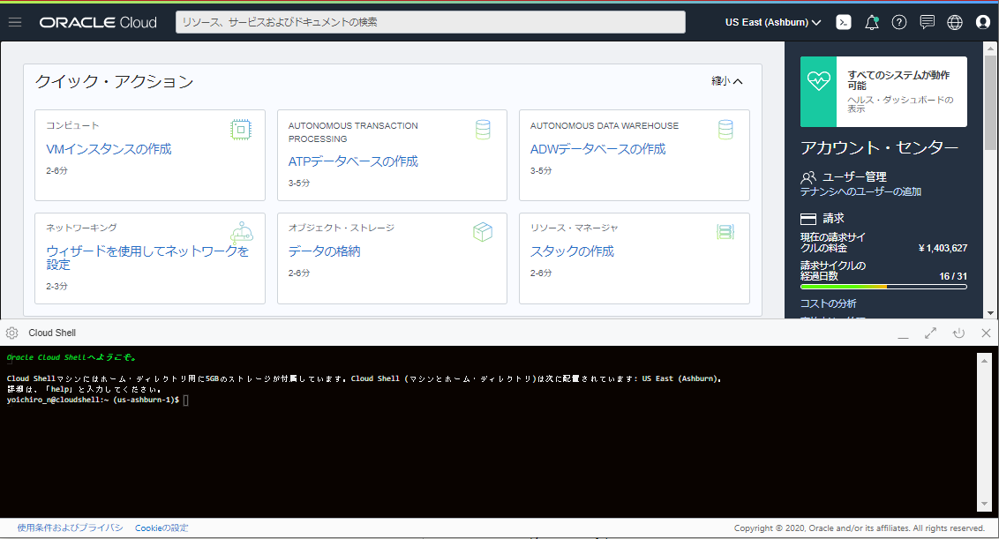

Oracle Functionsは、Oracleが提供するオープンソースのFaaSプラットフォームであるFn Projectのマネージドサービスです。  
このエントリーでは、Oracle Functions環境構築から動作確認までの手順を記します。
 
条件
----------------------
- クラウド環境
    * 有効なOracle Cloudアカウントがあること
    * [Fn Projectハンズオン](/ocitutorials/cloud-native/fn-for-beginners/)が完了していること(このハンズオンの理解を深めるため)

事前準備
---------

**注意事項: コンパートメントについて**  
Oracle Cloudにはコンパートメントという考え方があります。  
コンパートメントは、クラウド・リソース(インスタンス、仮想クラウド・ネットワーク、ブロック・ボリュームなど)を分類整理する論理的な区画で、この単位でアクセス制御を行うことができます。  
また、OCIコンソール上に表示されるリソースのフィルタとしても機能します。<br>今回は、ルートコンパートメントと呼ばれるすべてのリソースを保持するコンパートメントを利用するので、特に意識する必要がありません。
{: .notice--info}

**注意事項: ポリシーについて**  
Oracle Cloudでは、各ユーザーから各サービスへのアクセスおよび各サービスから他サービスへアクセスを「ポリシー」を利用して制御します。ポリシーは、各リソースに誰がアクセスできるかを指定することができます。
このハンズオンでは、テナンシ管理者を想定してポリシーを設定していきます。
{: .notice--info}

**注意事項: リージョンとリージョンコードについて**  
Oracle Cloudでは、エンドポイントやレジストリにアクセスする際にリージョンおよびリージョンコードを使用する場合があります。  
以下に各リージョンと対応するリージョンコードを記載します。  
本ハンズオンでは、OCI CLIのセットアップおよびOCIRのログイン時に使用します。

リージョン|リージョンコード
-|-
ap-tokyo-1|nrt
ap-osaka-1|kix
ap-melbourne-1|mel
us-ashburn-1|iad
us-phoenix-1|phx
ap-mumbai-1|bom
ap-seoul-1|icn
ap-sydney-1|syd
ca-toronto-1|yyz
ca-montreal-1|yul
eu-frankfurt-1|fra
eu-zurich-1|zrh
sa-saopaulo-1|gru
sa-vinhedo-1| vcp
uk-london-1|lhr
sa-santiago-1|scl
ap-hyderabad-1|hyd
eu-amsterdam-1|ams
me-jeddah-1|jed
ap-chuncheon-1|yny
me-dubai-1|dxb
uk-cardiff-1|cwl
us-sanjose-1|sjc


<div class="notice--warning">
  {{ notice | markdownify }}
</div>

ここでは、Oracle Functionsのハンズオンを実施するためにOCI(Oracle Cloud Infrastructure)に対してポリシーの設定を行います。

Oracle Cloudのダッシューボードにログインし、ダッシューボード画面のハンバーガーメニューで[アイデンティティとセキュリティ]=>[ポリシー]をクリックします。

  
"ポリシーの作成"をクリックします。


"名前"に任意の名前(特にこだわりがなければ"Oracle-Functions-Policy")を入力、"説明"にも名前と同様の値を入力、"手動エディタ"の表示にチェックを入れてテキストボックスに以下の2つを入力し、"作成"をクリックします。  
以下の2つのポリシーによって、Oracle FunctionsからのVCN(ネットワーク)の使用およびファンクションを格納するレジストリの使用を許可します。

* Allow service FaaS to read repos in tenancy


以上で、事前準備は完了です。

1.Cloud Shellのセットアップ
-------------------
本ハンズオンではOKEクラスターを操作するいくつかのCLIを実行するための環境としてCloud Shellと呼ばれるサービスを使用します。
Cloud ShellはOracle CloudコンソールからアクセスできるWebブラウザベースのコンソールです。
Cloud Shellには、OCI CLIをはじめとして、次のようないくつかの便利なツールおよびユーティリティの現在のバージョンがインストールされています。
詳細は、[公式ドキュメントの記載](https://docs.cloud.oracle.com/ja-jp/iaas/Content/API/Concepts/cloudshellintro.htm)をご確認ください。

インストール済みツール |
-|
Git |
Java |
Python (2および3) |
SQL Plus |
kubectl |
helm |
maven |
gradle |
terraform |
ansible |
fn |

**Cloud Shellついて**  
Cloud Shellは開発専用ではなく、一時的にOCIコマンドを実行したい場合などライトなご利用を想定したサービスであるため、実運用時はCLI実行環境を別途ご用意ください。
{: .notice--warning}

OCIコンソール上で右上にあるターミナルのアイコンをクリックします。


しばらく待つと、Cloud Shellが起動されます。　　



デフォルトでは、Cloud Shellが利用しているCPUアーキテクチャが`ARM`である可能性があります。  
今回は、`X86_64`を利用したいので、利用するCPUアーキテクチャを修正します。  

Cloud Shellの左側にある`アーキテクチャ`をクリックします。  


希望するアーキテクチャを`X86_64`に変更し、`確認して再起動`をクリックします。  


インスタンスの再起動というダイアログが表示されたら、`再起動`をクリックします。  


しばらくすると、Cloud Shellが起動します。

起動後に以下のコマンドで確認してみましょう。  
このハンズオンに必要なCLI(`fn`コマンド)はデフォルトでインストール済みです。  

```
fn --version
```

以下のような結果となれば、`fn`コマンドは正常にインストールされています。
```
fn version 0.6.33
```

以上で、準備作業は完了です。

2.Oracle Functions実行環境の構築
---------------------------------------------------
ここでは、Oracle Functionsを動作させるための環境を構築します。  

### 2-1. Oracle Functionsが利用するVCNの作成
Oracle Cloudのダッシューボードにログインし、ダッシューボード画面のハンバーガメニューで"ネットワーキング"=>"仮想クラウド・ネットワーキング"をクリックします。


表示された画面左下の"スコープ"内の"コンパートメント"をクリックし、ルートコンパートメント(下記の場合は"functionshandson")を選択します。ルートコンパートメントはOracle Cloudの登録時に設定した名称になります。既に選択されている場合は、この手順はスキップしてください。


"VCNウィザードの起動"をクリックします。


"インターネット接続性を持つVCN"を選択し、"ワークフローの起動"をクリックします。


以下の情報を入力し、"次"をクリックします。


* VCN名：任意の名前(こだわりがなければ"Oracle Functions Handson")
* コンパートメント：ルートコンパートメント
* VCN CIDRブロック：`10.0.0.0/16`
* パブリック・サブネットCIDRブロック：`10.0.0.0/24`
* プライベート・サブネットCIDRブロック：`10.0.1.0/24`

"作成"をクリックします。


"仮想クラウド・ネットワークの表示"をクリックします。  


以上で、VCN(ネットワーク)の作成は終わりです。

### 2-2. Oracle Functionsのアプリケーションの作成
ここでは、Oracle Functionsのアプリケーションの作成を行います。

OCIのコンソールに移り、"開発者サービス"の"ファンクション"をクリックします。


"アプリケーションの作成"をクリックします。


名前に"helloworld-app"と入力、VCNに[2-1. Oracle Functionsが利用するVCNの作成](#2-1-oracle-functionsが利用するvcnの作成)で作成したネットワーク名を選択、サブネットにVCNに紐づくパブリックサブネットを選択、シェイプに`GENERIC_X86`を選択し、"作成"をクリックします。


以上で、Oracle Functionsのアプリケーションの作成は完了です。

### 2-3. OCI Functionsのサンプルアプリケーション実行

ここでは、OCI Functionsのサンプルアプリケーションを実行します。  
アプリケーションの実行にはいくつかの手順が必要ですが、[2-2. Oracle Functionsのアプリケーションの作成](#2-2-Oracle Functionsのアプリケーションの作成)で作成したアプリケーションにスタートガイドがあるので、こちらの手順をベースに実施します。  

先ほど作成したアプリケーションをクリックします。  


左下にある`スタート・ガイド`をクリックします。  


こちらにJavaのサンプルアプリケーション実行までを整理した手順があるので、こちらをベースに移行の手順を実施します。  


①~③については、ガイドにあるコマンドをCloud Shell上でそのまま実行してください。  

④については、[repo-name-prefix]を任意のコンテナイメージ名に置き換えてCloud Shell上で実行してください。  

**集合ハンズオンや共有環境の場合**  
集合ハンズオンなどの1つの環境を複数人で共有している場合、コンテナイメージパスが重複する場合があります。  
その場合は、コンテナイメージ名にイニシャルを付与するなど、重複をしないようにコンテナイメージ名をきめてください。  

<div class="notice--warning">
  {{ notice | markdownify }}
</div>

⑤については、ガイドのリンクをクリックします。　　

ユーザーの詳細画面の左側のメニューで、"認証トークン"をクリックし、さらに"トークンの生成"をクリックします。


"説明"に"This token is used for Oracle Functions Handson"と入力し、"トークンの生成"をクリックします。


以下の画面が表示されるので、"コピー"をクリックし、これを手元のテキストエディタなどにペーストしておきます。


⑥〜⑪については、ガイドにあるコマンドをCloud Shell上でそのまま実行してください。  

⑪の実行後に以下が表示されれば、OCI Functionsを無事に実行できています。  

```sh
takuya_nii@cloudshell:hello-java (ap-tokyo-1)$ fn invoke helloworld-app hello-java
Hello, world!
```

【オプション】3.Podman環境で作業する場合
---------------------------------------------------
この手順は、Dockerの代わりにPodmanがインストールされた環境向けの手順です。  
Dockerを利用する方はこの手順は無視してください。  
Cloud Shellを利用している方は、この手順は不要です。  
なお、PodmanはFn Project CLI v0.6.12以降で利用可能です。 

Fn CLIのconfigを編集し、利用するコンテナエンジンを以下のようにPodmanに変更します。  

    vim ~/.fn/config.yaml

```yaml
cli-version: 0.6.13
container-enginetype: podman # <== "docker"から"podman"に変更
current-context: ap-tokyo-1
```

以上で、Podman環境設定は完了です。