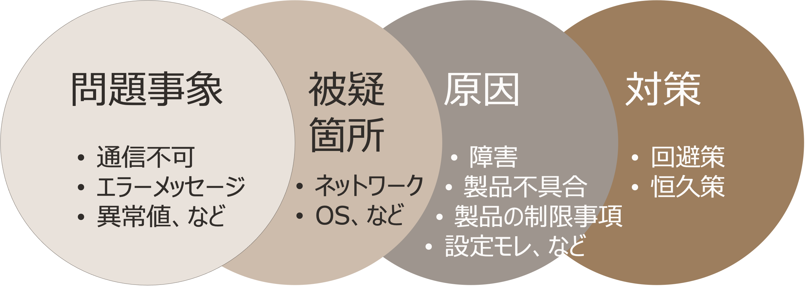
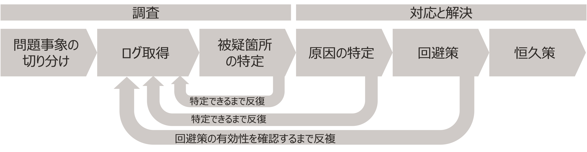
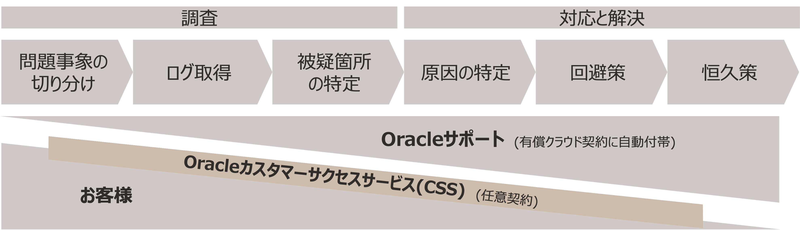

**本資料の目的 :** この文書は、お客様がトラブル解決のために技術サポート（Support RequestまたはService Request、以下SRと略します）を効果的に活用するためのポイント、記載すべき項目、伝える際の注意事項をまとめたものです。サポート側は、個々の問い合わせに誠実に取り組み、解決に向けて最善の努力を尽くします。サポート側とお客様が協力し合うことは、トラブルの早期解決に寄与します。これらはすべて任意の内容ですので、必ずしも全てを実施しなければならないわけではありません。なにをどこまで参考にするかはそれぞれのご判断で取り入れていただけますようお願いします

**前提条件 :** OCIを利用するお客様・パートナー様のエンジニア向け。ただし技術サポートツールの「操作方法」については本文書には含みませんので、下記各種ガイドをご参照ください

([製品別サポート窓口／ご利用ガイド](https://www.oracle.com/jp/support/support-services-list/ "製品別サポート窓口／ご利用ガイド"){:target="_blank"})

([新クラウドサポートポータル (My Oracle Cloud Support) のご案内（PDF)](https://www.oracle.com/jp/a/ocom/docs/customer-portal-experience-jp.pdf "新クラウドサポートポータル (My Oracle Cloud Support) のご案内（PDF)"){:target="_blank"})

([Oracle Cloud Supportご利用ガイド（PDF)](https://www.oracle.com/jp/a/ocom/docs/oracle-cloud-support-userguide-jp.pdf "Oracle Cloud Supportご利用ガイド（PDF)"){:target="_blank"})

 

**目次**

- [1. トラブル解決に向けた全体像と技術サポート(SR)の位置付け](#1-トラブル解決に向けた全体像と技術サポートsrの位置付け)
  - [1.1  トラブル解決とは](#11--トラブル解決とは)
  - [1.2  トラブル解決までの流れ](#12--トラブル解決までの流れ)
  - [1.3 関係者の役割分担と相互協力](#13-関係者の役割分担と相互協力)
- [2. SRを用いたトラブル解決のコツ](#2-srを用いたトラブル解決のコツ)
  - [2.1 やりとりの回数を減らすために](#21-やりとりの回数を減らすために)
  - [2.2 待ち時間を短くするために](#22-待ち時間を短くするために)
- [3. SR起票のコツ](#3-sr起票のコツ)
  - [3.1 落ち着いて状況を整理する(テンプレートの利用)](#31-落ち着いて状況を整理するテンプレートの利用)
  - [3.2 確定／送信前にチェックする(起票時のチェックリスト)　](#32-確定送信前にチェックする起票時のチェックリスト)

 

**所要時間：** 約10分

 

# 1. トラブル解決に向けた全体像と技術サポート(SR)の位置付け

## 1.1  トラブル解決とは

目の前で発生している「問題事象」を解決するためには、まず当然ながら、その「被疑箇所」を特定し、発生原因を明らかにします。その後、暫定的な回避策を適用し、同時に恒久的な対策が有効であることを確認・実施して、トラブルを解決できたと言えます

   

## 1.2  トラブル解決までの流れ

「問題事象の切り分け」や「ログ取得」などの各工程は、解決後に振り返ると一本道の活動のように見えるかもしれません。実際には、解決の過程において、ログを読み込み・分析し、さまざまな可能性を推定しながら疑義箇所を絞り込み・判断するなど、原因が特定できるまでは、追加調査や再調査が必要で、反復的な工程が含まれることがあります

 

## 1.3 関係者の役割分担と相互協力

トラブル解決のための技術サポート体制は、有料アカウントをお持ちのすべてのお客様に自動付帯される **「Oracleサポート」** が基本となります。加えて、プロアクティブにトラブル解決を行うサポートとして **「Oracleカスタマーサクセスサービス(CSS)」** が利用可能です
 

  **留意点：他クラウドとのサポート利用体系の違い**  
他の一般的なクラウドサービスプロバイダーでは、クラウド契約時にサポートプランを選択することでサポート利用が可能になります（月額クラウド利用額に比率を乗じたサポート利用料が発生）。それらとは異なり、OCIではお客様が契約時にサポートプランを選択することなく(サポート利用料を発生させずに)基本的な技術サポートを利用開始できる体系です
{: .notice--info}

 

1. **「Oracleサポート」の主な役割と役割分担の考え方** 
   -  **「Oracleサポート」** は、お客様が提起したSRに対して、解決への道筋として「ログ取得」をお客様に依頼します。しかし、「切り分け」や「ログ取得」の段階では、一度の作業で「原因の特定」に至ることは必ずしもありません。そのため、 **お互いに協力的な調査と対応を行うための双方向のコミュニケーション** が、早期解決のカギとなります

   - **「Oracleサポート」** は、SRの「被疑箇所の特定」と「原因の特定」以降の調査、分析、対応において、積極的な役割を果たします。 **お客様が「切り分け」などの調査をある程度ご自分で行えること** を前提としています。これはグローバル共通の標準サポートの対応になります

2. **「Oracleカスタマーサクセスサービス(CSS)」の活用** 

   - 特に、 **ミッションクリティカルシステムを運用する場合** や、 **「切り分け」などの調査をお客様自身が行える準備がまだできていない場合** 、 **「Oracleカスタマーサクセスサービス」**  の利用を検討してみてください。このサービスでは、専任のテクニカルアカウントマネージャー(TAM)が直接連携し、トラブル解決を含む運用を補完・強化します
   - 「Oracleカスタマーサクセスサービス」は任意の追加的契約によって提供されますので、対象範囲、サービスレベル、期間などのニーズに応じた内容が可能です
   
   

   **留意点：その他の関係者**  
   トラブル解決において「Oracleサポート」や「Oracleカスタマーサクセスサービス」 **以外の役割（担当セールスや担当アーキテクト、製品エンジニアなど）** が関与することは、一時的・例外的な対応であることに留意してください
   {: .notice--info}
   
[ページトップへ戻る](#anchor0)

 

# 2. SRを用いたトラブル解決のコツ

## 2.1 やりとりの回数を減らすために
1. **理解をつど確認** 
   - 「どこまで理解・確認したか」つまり解決に向けた進捗を共有しながら進めます
1. **範囲の絞り込み** 
   - 被疑箇所の範囲を絞り込むために、「これまでの調査により、なにが範囲外で、なにが範囲に含まれる可能性があるか」を整理しながら進めます
1.  **手順の確認** 
    - 切り分けのためのログ取得範囲、取得方法などを確認しながら進めます。手順を記載することで再現性が高まります
1.  **優先順位の更新** 
    - 前の質問の回答を待ちながら、追加で質問をする場合、つど優先順位を指定します。質問内容に変更がある場合は、「以前の質問をキャンセルします」等と明確に指示してください

   
**避けた方がよい例** 

  -  **知りたい理由や意図が伝わりにくい問合せ** を聞く
     - 質問内容が「トラブル解決に直接関連していないか」「意図が不明瞭でないか」という観点から検討することで、意図を確認するためのコミュニケーション回数を減らすことができます
  -  **思いついた案や気になる箇所が発散して分岐が複雑な問合せ** を同時に多数聞く
     - 思いついたアイデアや気になる点が複数ある場合、同時に多くの質問をすることでコミュニケーションが複雑になり、解決が難しくなることがあります。一度に解決を急ぎ過ぎることを避けるために、質問を選別しましょう

 

## 2.2 待ち時間を短くするために

1. **グローバル体制活用を見込んだ問合せによって時間短縮が見込まれます** 
   - 画面を送信する場合は、日本語表示から英語表示に切り替えた画面をキャプチャーします。ファイル名には英数字のみを使用し、日本語は含みません   
   - また、日本語から英語への翻訳を前提に、主語、動詞、目的語などを明確に記載します
   - 可能であれば、最初から英語で記述することで、時差を考慮せずに対応できます
1. **タイムリーな返信をこころがけます**
   - タイムリーな返信を心がけます。回答が届いているかを定期的に確認し、すみやかに返信します。質問をした方が確認や返信をうっかり忘れることがあるかもしれませんので、注意が必要です
   - 返信が極端に遅くなると、重大度が低いと判断され、他の問合せが優先される場合があります。初回起票時には、課題のタイプに応じて重大度が判定されます。例えば、「課題タイプ：クリティカルな停止」は、Oracleサポートとお客様の両方に24時間/7日間の対応が求められます

**待ち時間が長引いていると感じた場合** 
1. **「今対応できることがあるかどうか」を確認：** 
    - 催促や事象の伝達、認識合わせを目的として、サポートエンジニアにZOOMや電話での相談を希望します
1. **「マネジメント支援リクエスト」の依頼：** 
    - 特特定の期限内に解決が必要で、重要な問題に関して、マネージャが対応に関与するように依頼できます。詳細は、以下資料内の「SRに対するマネジメント支援依頼」の項目をご覧ください
     ([Oracle Cloud Supportご利用ガイド](https://www.oracle.com/jp/a/ocom/docs/cloud-1stguide-sr-2765641-ja.pdf "Oracle Cloud Supportご利用ガイド"){:target="_blank"})
2. **ナレッジの検索：** 
    - ナレッジ（既存情報）がOracle Cloud Supportにて公開されています。既存の情報で解決できるかもしれませんので、ナレッジ検索もご利用ください
　

**避けた方がよい例** 

-  **膨大な分量のログを添付** 
   - 膨大なログの添付は、内容の確認に時間がかかるだけでなく、対応が遅れる可能性もあります
-  **お客様組織の関連システムの知識を前提とするような質問** 
   - 例：「この対応をとった場合、当社の環境で問題は発生しませんか？」 → すべての影響範囲を知ることが難しいため、断定的な回答は難しいです
-  **保証や確約を厳密に求める** 
   - 例：「上記の対応をすれば解決すると保証してくれますか？」→可能性の程度はいえるかもしれませんが、断言することは難しいです

[ページトップへ戻る](#anchor0)
 

# 3. SR起票のコツ
## 3.1 落ち着いて状況を整理する(テンプレートの利用)
- トラブルに遭遇した際、気持ちがはやることは理解できます。しかし、もし未整理の状態でSRを起票すると、基本的な確認に時間がかかることがあります。従って、冷静に状況を整理しましょう。整理された情報を提供することで、問題解決に向けて確実に進むことができます
- 重要な情報を漏れなく伝えるために、テンプレートを利用してみてはいかがでしょうか。全ての項目に記入する必要はありません。不明な情報は、SRを起票した後のコミュニケーションで確認および補完していきます
 

ーーーーーSR記載テンプレート（例）ーーーーー
 

1. **問合せ内容**
   - 問合せ内容：
   - 問合せの目的、ゴール：
 
2. **事象の内容**
   - 事象の内容：
   - エラーメッセージ、コード：
   - 事象発生日時：
   - 事象発生時の状況：

3. **現在の状況**
   - 現在の状況：
   - 業務影響：

4. **対象システム情報**
   - 対象システム（システム名、及び本番機、開発機など）：
   - 対象製品・サービス、バージョン、適用パッチ：

5. **調査情報**
   - 切り分け情報（もしあれば）：
   - 再現手順（もしあれば）：
   - ログ・トレース情報（もしあれば）：
   - コマンドの出力結果など（もしあれば）：

6. **連絡先**
   - 会社名/部署名 ：
   - 名前 ：　
   - 電話番号(確実に連絡がとれる番号)：

ーーーーーテンプレートここまでーーーーー

 

## 3.2 確定／送信前にチェックする(起票時のチェックリスト)　

確定する前に選択項目が実態と相違がないか、以下の点でチェックしてみてください
 

- **言語、サービスタイプ、課題タイプ、利用サービス名、問題タイプ** など適切に記載してください。これによって重要度の設定が行われます
  - 不明な場合や誤った情報を提供しても、サポートエンジニアは適切に訂正しますが、正確な情報提供によってコミュニケーションの効率が向上します
- **「 1SRにつき1件の質問」が推奨です：**  1つのSRに1名のサポートエンジニアが対応するため、複数の質問がある場合は複数のSRに分けて起票することで対応が効率化します
- **お客様組織内独自の用語を使わない：** 独自の用語は確認に時間がかかり、誤解を生じる可能性があるため、一般的な用語を使用しましょう
- **SRでの回答対象外の質問:**
  - **「製品の性能に関する質問」はお答えできません**：各製品・サービスの性能指標については、お客様の環境に依存する要素も含むため、SRでの回答の対象外です

より的確に記載するために、以下のチェックリストを参考にしてみてはいかがでしょうか

 

ーーーーーSR記載チェックリストーーーーー
 
SR起票の際、以下の情報が明確に記載されているかご確認してみてください
 

1. **SR起票**
   - 言語、サービスタイプ、課題タイプ、利用サービス名、問題タイプなど正しく選択していますか

2. **問題サマリの記載**
   - 分かりやすく分類しやすいサマリを記載していますか
     - 対象システムの名称、及び対象の製品名など
     - 本番機、開発機など対象システムの種別
     - 障害の場合は症状を簡潔に記載

3. **問合せ内容の記載**
   - 問合せの目的、内容は明確ですか
     - 事象が継続している場合の回避策の提供が目的ですか
     - 事象が回避されている場合など原因の調査が目的ですか
     - 1つのSRに複数の問い合わせを記載していませんか　
     - 製品の性能、及び設計に関する質問が含まれていませんか　（各製品及びサービスの性能指標や、設計要素を含んだ質問はSR回答対象外です）
  
   - 発生した事象の内容は明確ですか
     - 事象が発生している対象のシステム（本番機、開発機など）、製品、バージョン、適用パッチの情報
     - 事象の発生日時（JSTなど Timezoneを明確にしてください）
     - 事象発生までの時系列の経過（複数回発生している場合はその状況も含む）
     - 事象の内容（処理の失敗、エラー内容、エラーコード、インスタンスダウン、レスポンス低下など）
     - お客様組織内で独自に使われている用語を記載していませんか　（お客様組織内独自の用語は確認のための時間を要するとともに、認識に誤解を生じさせる場合があります。一般的な用語を使ってください）
  
   - 事象発生時の状況は正確ですか
     - どの様な処理の際に事象が発生したましたか（具体的な処理の内容）
     - 問題が発生したときの状況（システムの負荷が高い/低い、いつもの処理/初めての処理、通常と異なる点など）

   - 事象による影響は記載していますか
     - 現在の状況（システムは運用できていますか、事象は継続していますか、一時的な事象か、など）
     - 事象による業務影響（業務への影響以外にも、プロジェクトのマイルストーンへの影響や、事業への影響を記載。分かり次第、追記ください）

   - 調査に有効な情報を記載（添付）していますか
     - エラー発生時のログ類や画面キャプチャなど
     - 問題の切り分けを行った場合は切り分け情報
     - 再現手順があれば、事象を再現させる手順の説明
     - 問題が発生する場合としない場合の相違点
     - 対象製品の製品のログ／トレース情報など　※ログやトレースを添付する場合は、可能であれば、事象発生の時間帯などに範囲を限定し、明らかに調査範囲からはずれる情報を除外するなどします

ーーーーーチェックリストここまでーーーーー

この記事おわり
 

[ページトップへ戻る](#anchor0)
